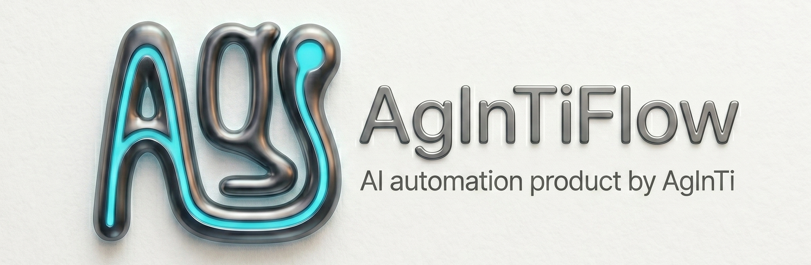

[English](README.md) · [العربية](i18n/README.ar.md) · [Español](i18n/README.es.md) · [Français](i18n/README.fr.md) · [日本語](i18n/README.ja.md) · [한국어](i18n/README.ko.md) · [Tiếng Việt](i18n/README.vi.md) · [中文 (简体)](i18n/README.zh-Hans.md) · [中文（繁體）](i18n/README.zh-Hant.md) · [Deutsch](i18n/README.de.md) · [Русский](i18n/README.ru.md)

<p align="center">
  
</p>

<p align="center">
  
</p>

# AgInTiFlow


**Low-cost, project-aware agents for real-life problems.**

Use the same agent workspace from Web or CLI, with DeepSeek/Venice/OpenAI routing, visible tool calls, durable sessions, scouts, SCS supervision, AAPS workflows, and guarded local execution.

The short version: run `aginti` inside a project, give it a task, inspect what it plans, see every tool call, resume later, and keep the outputs in your workspace.

## Visual Preview

The two screenshots below match the current website hero: terminal-first launch on the left, browser console visibility on the right.

| CLI launch | Web console |
| --- | --- |
|  |  |

**Links**

| Resource | URL |
| --- | --- |
| Website | [https://flow.lazying.art](https://flow.lazying.art) |
| GitHub | [https://github.com/lazyingart/AgInTiFlow](https://github.com/lazyingart/AgInTiFlow) |
| npm | [https://www.npmjs.com/package/@lazyingart/agintiflow](https://www.npmjs.com/package/@lazyingart/agintiflow) |
| AAPS npm | [https://www.npmjs.com/package/@lazyingart/aaps](https://www.npmjs.com/package/@lazyingart/aaps) |
| Product positioning | [references/agintiflow-product-positioning.md](references/agintiflow-product-positioning.md) |
| Full archived README reference | [references/notes/readme-full-reference-2026-05-05.md](references/notes/readme-full-reference-2026-05-05.md) |

## Why This Exists

Most agent tools are either a chat box with hidden state or an expensive one-model loop. AgInTiFlow is built around a different philosophy:

| Principle | What it means in practice |
| --- | --- |
| Cheap intelligence changes the architecture | DeepSeek V4 Flash and Pro make it practical to spend more calls on routing, scouting, review, and recovery instead of forcing one expensive call to do everything. |
| Inspectable beats mysterious | Plans, tool calls, file diffs, command output, canvas artifacts, and session events are saved and resumable. |
| Disciplined by default | `AGINTI.md` starts with a behavior contract: surface ambiguity, keep edits surgical, avoid speculative complexity, verify outcomes, and respect permission blockers. |
| Role-based models | Route, main, spare, wrapper, and auxiliary image roles are separate. You can use cheap route models, stronger main models, optional OpenAI/Qwen/Venice routes, and GRS AI/Venice image tools. |
| Scouts before big work | Parallel scouts can cheaply map architecture, tests, risks, symbols, and integration points before the main executor edits anything. |
| SCS for high-risk work | Student-Committee-Supervisor mode adds a typed gate: committee drafts, student approves/monitors, supervisor executes. Use `/scs` or `--scs auto`. |
| AAPS for large workflows | AAPS describes top-down agentic pipeline scripts; AgInTiFlow can act as the interactive backend that validates, compiles, and executes those workflows. |
| Local safety by default | Docker workspace mode, path guardrails, secret redaction, blocked npm publish/token commands, and visible logs keep the agent practical without making it opaque. |

## Quick Start

Install and open a project:

```bash
npm install -g @lazyingart/agintiflow
cd /path/to/your-project
aginti init
aginti
```

`aginti init` creates a disciplined `AGINTI.md` by default: project identity, ambiguity protocol, surgical-change policy, verification contract, permission policy, artifact naming, commands, style, and definition of done. For a smaller or domain-specific starting point:

```bash
aginti init --list-templates
aginti init --template minimal
aginti init --template coding
aginti init --template research
aginti init --template writing
aginti init --template design
aginti init --template aaps
aginti init --template supervision
```

On first interactive use, AgInTiFlow opens an auth wizard if no main model key is found. Pick DeepSeek, OpenAI, Qwen, or Venice, paste the key, and it saves to the ignored project-local `.aginti/.env` file with restricted permissions. You can rerun setup any time:

```bash
aginti auth
aginti auth deepseek
aginti auth venice
aginti login grsai
```

Provider signup and key pages:

| Provider | Register / key page | API base URL used by AgInTiFlow |
| --- | --- | --- |
| DeepSeek | [https://platform.deepseek.com/api_keys](https://platform.deepseek.com/api_keys) | `https://api.deepseek.com` |
| Venice | [https://venice.ai/settings/api](https://venice.ai/settings/api) | `https://api.venice.ai/api/v1` |
| OpenAI | [https://platform.openai.com/api-keys](https://platform.openai.com/api-keys) | `https://api.openai.com/v1` |
| Qwen / DashScope | [https://bailian.console.aliyun.com/](https://bailian.console.aliyun.com/) | `https://dashscope-intl.aliyuncs.com/compatible-mode/v1` |
| GRS AI image tools | [https://grsai.ai/dashboard/api-keys](https://grsai.ai/dashboard/api-keys) | Configure with `/auxiliary grsai` or `aginti login grsai` |

Launch the web UI from the same project:

```bash
aginti web --port 3210
# open http://127.0.0.1:3210
```

Run without live model credentials for smoke tests:

```bash
aginti --provider mock --routing manual --allow-file-tools "Create notes/hello.md with a smoke-test note"
```

Use a language explicitly, or omit it to follow your system locale:

```bash
aginti --language ja
aginti --language zh-Hans
aginti --language de
```

## Daily Commands

| Goal | Command |
| --- | --- |
| Start interactive chat | `aginti` or `aginti chat` |
| Start local web app | `aginti web --port 3210` |
| Save provider keys | `aginti auth`, `/auth`, `/login` |
| Review current repo | `/review [focus]` |
| Toggle SCS quality gate | `/scs` |
| Use SCS only for complex work | `/scs auto` or `aginti --scs auto "task"` |
| Work with AAPS workflows | `aginti aaps status`, `/aaps validate` |
| Choose models | `/route`, `/model`, `/spare`, `/wrapper`, `/auxiliary model` |
| Switch permissions | `-s safe`, `-s normal`, `-s danger`, or `/safe`, `/normal`, `/danger` |
| Enable Venice shortcut | `/venice` |
| Generate images | `/auxiliary image`, then ask for an image |
| Resume current project | `aginti resume` |
| Browse all sessions | `aginti resume --all-sessions` |
| Queue into a running session | `aginti queue <session-id> "extra instruction"` |
| Clean empty sessions | `aginti --remove-empty-sessions` |
| Check capabilities | `aginti capabilities`, `aginti doctor --capabilities` |
| Sync reviewed skills | `aginti skillmesh status`, `aginti skillmesh sync` |
| Update CLI | `aginti update` |

Interactive chat supports slash completion, Up/Down selectors, multiline input with `Ctrl+J`, full resume history, Markdown rendering, visible run status, ASAP pipe messages during a run, and clean interruption/resume with `Ctrl+C`. Installed interactive commands also check npm for a newer AgInTiFlow release and show an update/skip selector; source checkouts and non-TTY automation are left alone.

For a fully controlled one-shot resume, use an explicit session id and choose the task profile deliberately. Use `auto` for normal routing or `android` when the work is Android/emulator-specific:

```bash
PROFILE=android  # or auto
aginti --resume <session-id> \
  --profile "$PROFILE" \
  --sandbox-mode host \
  --package-install-policy allow \
  --approve-package-installs \
  --allow-shell \
  --allow-file-tools \
  --allow-destructive \
  "Take a fresh screenshot of the running app in the emulator, save it with a durable filename in this project, and keep git status clean."
```

Permission behavior is intentionally consistent. Use `-s safe` for read-first sessions that ask before writes/setup, `-s normal` for current-project writes plus Docker setup, and `-s danger` for trusted host/full-access work. Inside chat, `/safe`, `/normal`, and `/danger` switch the current session. When a blocked action appears, CLI and web can offer `No`, `Yes this time`, or `Yes and always for this session` instead of making the agent retry command variants. Android/Gradle builds can use safe local env assignments such as `ANDROID_HOME=... JAVA_HOME=... ./gradlew assembleDebug` and relative workspace logs without requiring whole-host destructive mode. See [runtime modes and autonomy](docs/runtime-modes-and-autonomy.md) for the full contract.

Tmux follows the same rule. In Docker sandbox mode, `tmux_start_session` and `tmux_send_keys` are durable host tools, but their commands must stay workspace-bound. In host mode, tmux startup/send command text follows the same host shell policy as `run_command`; broad host shell work needs explicit `--allow-destructive`. Use `--sandbox-mode host --allow-destructive` only when a tmux task really needs trusted whole-host execution.

## Permission Recipes

Use these when you want explicit control instead of the default interactive policy:

| Mode | Command | What it permits |
| --- | --- | --- |
| Safe | `aginti -s safe "inspect this project and ask before edits"` | Docker read-only posture, package/setup approval required, and file-tool writes stop for approval. |
| Normal | `aginti -s normal "build and test this project"` | Current-project file writes and Docker workspace package/setup are allowed; outside-project writes and host-system changes still stop. |
| Danger | `aginti -s danger "perform the trusted host maintenance task"` | Trusted host mode with destructive shell, host installs, password typing, and outside-workspace file paths enabled. Hard secret/publish guards still protect obvious credential leaks. |

For resume:

```bash
aginti --resume <session-id> \
  -s danger \
  "continue with trusted host access"
```

## Screenshots

The website keeps the visual walkthrough in a carousel so this README can stay focused on setup and usage:

| View | Link |
| --- | --- |
| Website carousel | [https://flow.lazying.art/#screenshots](https://flow.lazying.art/#screenshots) |
| CLI launch | [demos/agintiflow-cli-launch.jpg](demos/agintiflow-cli-launch.jpg) |
| Web console run output | [demos/agintiflow-web-console-run-output.jpg](demos/agintiflow-web-console-run-output.jpg) |
| Web app screenshots | [website/assets/screenshots/](website/assets/screenshots/) |
| Older launch screenshots | [demos/archive/](https://github.com/lazyingart/AgInTiFlow/tree/main/demos/archive) |

## Core Capabilities

| Capability | What AgInTiFlow provides |
| --- | --- |
| CLI agent workspace | Persistent terminal chat with project cwd, session resume, visible model/tool state, and clean command hints. |
| Local web workspace | Browser UI for sessions, runtime logs, artifacts, model settings, project controls, canvas previews, and sandbox status. |
| File tools | `inspect_project`, `list_files`, `read_file`, `search_files`, `write_file`, `apply_patch`, `open_workspace_file`, and `preview_workspace`. |
| Shell tools | Guarded host or Docker workspace shell execution with package-install policy and command safety checks. |
| Browser tools | Playwright browser actions with lazy startup and optional domain allowlists. |
| Model routing | DeepSeek fast/pro defaults, manual OpenAI/Qwen/Venice/mock routes, spare models, wrapper models, and auxiliary image models. |
| Patch workflow | Codex-style patch envelopes, unified diffs, exact replacements, hashes, compact diffs, and path guardrails. |
| Parallel scouts | Optional scout calls for architecture, implementation, review, tests, git flow, research, symbol tracing, and dependency risk. |
| SCS mode | Optional Student-Committee-Supervisor quality gate for complicated or risky tasks. |
| AAPS adapter | Optional `@lazyingart/aaps` integration for `.aaps` workflow init, validate, parse, compile, dry-run, and run commands. |
| Image generation | Optional GRS AI and Venice image tools with saved manifests and canvas artifact previews. |
| Skill library | Built-in Markdown skills for code, websites, Android/iOS, Python, Rust, Java, LaTeX, writing, reviews, GitHub, AAPS, and more. |
| Skill Mesh | Optional strict skill recording/sharing for reviewed reusable skill packs. If unused, AgInTiFlow runs normally without background sharing. |
| Multilingual UI | CLI and docs language support for English, Japanese, Simplified/Traditional Chinese, Korean, French, Spanish, Arabic, Vietnamese, German, and Russian. |

## Models And Roles

AgInTiFlow does not treat "the model" as one global setting. It has roles:

| Role | Default | Purpose |
| --- | --- | --- |
| Route | `deepseek/deepseek-v4-flash` | Cheap planner, triage, short tasks, routing decisions. |
| Main | `deepseek/deepseek-v4-pro` | Complex coding, debugging, writing, research, long tasks. |
| Spare | `openai/gpt-5.4` medium | Optional fallback or cross-check route. |
| Wrapper | `codex/gpt-5.5` medium | Optional external coding-agent advisor. |
| Auxiliary | `grsai/nano-banana-2` | Image generation and other non-text helper tools. |

Useful selectors:

```text
/models
/route
/model
/spare
/wrapper
/auxiliary model
/venice
```

Venice routes can be used for optional uncensored or less restricted creative work. DeepSeek remains the economic default for normal engineering workflows. See [docs/model-selection.md](docs/model-selection.md) and [references/venice-model-reference.md](references/venice-model-reference.md).

## AAPS And Large Workflows

AAPS is the pipeline-script layer; AgInTiFlow is the interactive agent/tool backend.

```bash
aginti aaps status
aginti aaps init "Project Workflow"
aginti aaps validate
aginti aaps compile check
```

Inside chat:

```text
/aaps on
/aaps validate
/aaps dry-run workflows/main.aaps
```

Use AAPS when the task is bigger than a single chat: app development with stages, paper/book workflows, validation gates, recovery steps, artifact production, or top-down agentic scripts. There are two bridge directions: AgInTiFlow can inspect/validate/compile/run `.aaps` workflows with `aginti aaps ...`, and AAPS can call AgInTiFlow as the backend implementation agent with `aaps prompt "goal" --backend aginti`. See [docs/aaps.md](docs/aaps.md) and the package [https://www.npmjs.com/package/@lazyingart/aaps](https://www.npmjs.com/package/@lazyingart/aaps).

## Local API Quick Reference

The web app exposes local APIs for UI and automation. These endpoints report state without exposing raw API keys or npm tokens:

```bash
curl http://127.0.0.1:3210/api/config
curl http://127.0.0.1:3210/api/capabilities
curl http://127.0.0.1:3210/api/sandbox/status
curl -X POST http://127.0.0.1:3210/api/sandbox/preflight \
  -H 'Content-Type: application/json' \
  -d '{"sandboxMode":"docker-workspace","buildImage":true}'
curl http://127.0.0.1:3210/api/workspace/changes
curl "http://127.0.0.1:3210/api/sessions/<session-id>/artifacts"
curl "http://127.0.0.1:3210/api/sessions/<session-id>/inbox"
```

Run the credential-free API smoke test:

```bash
npm run smoke:web-api
```

## Storage, Safety, And Resume

AgInTiFlow stores canonical sessions centrally and keeps only project-local pointers:

| Location | Purpose |
| --- | --- |
| `~/.agintiflow/sessions/<session-id>/` | Canonical state, events, browser state, artifacts, snapshots, canvas files. |
| `<project>/.aginti-sessions/` | Project-local session pointers and web UI database. Ignored by git. |
| `<project>/.aginti/.env` | Optional project-local API keys with restricted permissions. Ignored by git. |
| `<project>/AGINTI.md` | Editable project instructions and durable local preferences. Safe to commit if it contains no secrets. |

Safety defaults:

- Docker workspace mode is the normal CLI/web default for practical coding and artifact generation.
- Secret-like paths, `.env`, `.git`, `node_modules` writes, absolute escapes, huge files, and binary edits are blocked by file tools.
- Shell commands are policy checked; npm publish, npm token commands, sudo, destructive git, and credential reads are blocked.
- File writes record hashes and compact diffs.
- Tool calls and results are logged into structured session events.
- The web and CLI both use the same session store, so a run can be inspected and resumed later.

Detailed runtime notes are in [docs/runtime-modes-and-autonomy.md](docs/runtime-modes-and-autonomy.md), [docs/patch-tools.md](docs/patch-tools.md), and [docs/agent-runtime-pipe.md](docs/agent-runtime-pipe.md).

## Configuration

Common environment variables:

```bash
DEEPSEEK_API_KEY=...
OPENAI_API_KEY=...
QWEN_API_KEY=...
VENICE_API_KEY=...
GRSAI_API_KEY=...
AGENT_PROVIDER=deepseek
AGENT_ROUTING_MODE=smart
AGINTI_TASK_PROFILE=auto
AGINTI_LANGUAGE=en
SANDBOX_MODE=docker-workspace
PACKAGE_INSTALL_POLICY=allow
COMMAND_CWD=/path/to/project
```

Project-local keys:

```bash
aginti init
printf '%s' "$DEEPSEEK_API_KEY" | aginti keys set deepseek --stdin
printf '%s' "$VENICE_API_KEY" | aginti keys set venice --stdin
```

More detail:

- [docs/model-selection.md](docs/model-selection.md)
- [docs/auxiliary-image-generation.md](docs/auxiliary-image-generation.md)
- [docs/cli-i18n.md](docs/cli-i18n.md)
- [docs/skillmesh.md](docs/skillmesh.md)

## Documentation Map

| Topic | Link |
| --- | --- |
| AAPS adapter | [docs/aaps.md](docs/aaps.md) |
| Model selection and roles | [docs/model-selection.md](docs/model-selection.md) |
| SCS mode | [docs/student-committee-supervisor.md](docs/student-committee-supervisor.md) |
| Large-codebase engineering | [docs/large-codebase-engineering.md](docs/large-codebase-engineering.md) |
| Runtime modes and autonomy | [docs/runtime-modes-and-autonomy.md](docs/runtime-modes-and-autonomy.md) |
| Skills and tools | [docs/skills-and-tools.md](docs/skills-and-tools.md) |
| Skill Mesh | [docs/skillmesh.md](docs/skillmesh.md) |
| Housekeeping logs | [docs/housekeeping.md](docs/housekeeping.md) |
| npm publishing | [docs/npm-publishing.md](docs/npm-publishing.md) |
| Product roadmap | [docs/productive-agent-roadmap.md](docs/productive-agent-roadmap.md) |
| Supervised capability curriculum | [docs/supervised-capability-curriculum.md](docs/supervised-capability-curriculum.md) |
| Full older README reference | [references/notes/readme-full-reference-2026-05-05.md](references/notes/readme-full-reference-2026-05-05.md) |

## Development

Run from source:

```bash
git clone https://github.com/lazyingart/AgInTiFlow.git
cd AgInTiFlow
npm install
npx playwright install chromium
npm run check
npm test
```

Start local web from source:

```bash
npm run web
# open http://127.0.0.1:3210
```

Useful smoke checks:

```bash
npm run smoke:web-api
npm run smoke:coding-tools
npm run smoke:aaps-adapter
npm run smoke:cli-chat
npm run smoke:toolchain-docker
```

The smoke scripts use the local mock provider unless explicitly marked as real-provider tests.

## Release Notes

AgInTiFlow is published as `@lazyingart/agintiflow`. Preferred release path is GitHub Actions Trusted Publishing with npm provenance. Local token publishing is only a fallback for bootstrapping and should never commit `.env`, `.npmrc`, npm tokens, OTPs, or debug logs.

See [docs/npm-publishing.md](docs/npm-publishing.md) for the full release workflow.

## Support

If this project is useful, support development here:

| Support | URL |
| --- | --- |
| GitHub Sponsors: LazyingArt | [https://github.com/sponsors/lazyingart](https://github.com/sponsors/lazyingart) |
| GitHub Sponsors: Lachlan Chen | [https://github.com/sponsors/lachlanchen](https://github.com/sponsors/lachlanchen) |
| LazyingArt | [https://lazying.art](https://lazying.art) |
| Chat | [https://chat.lazying.art](https://chat.lazying.art) |
| OnlyIdeas | [https://onlyideas.art](https://onlyideas.art) |

AgInTiFlow is developed by AgInTi Lab, LazyingArt LLC.
