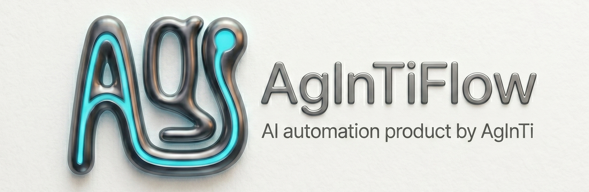

[English](README.md) · [العربية](i18n/README.ar.md) · [Español](i18n/README.es.md) · [Français](i18n/README.fr.md) · [日本語](i18n/README.ja.md) · [한국어](i18n/README.ko.md) · [Tiếng Việt](i18n/README.vi.md) · [中文 (简体)](i18n/README.zh-Hans.md) · [中文（繁體）](i18n/README.zh-Hant.md) · [Deutsch](i18n/README.de.md) · [Русский](i18n/README.ru.md)

<p align="center">
  
</p>

<p align="center">
  
</p>

# AgInTiFlow


**Project-aware, low-cost agents for real problems.**

AgInTiFlow is a project-aware agent workspace for hybrid wet-dry R&D, hardware-aware intelligence, software automation, and industrial workflows. From lab planning to data analysis, from hardware control to production scripts, and from microscopy, drones, and robots to reports, it helps agents work through API, Web, or CLI with SCS supervision, AAPS workflows, guarded execution, and durable evidence.

The short version: run `aginti` inside a project, give it a task, inspect what it plans, see every tool call, resume later, and keep the outputs in your workspace.

## Visual Preview

The two screenshots below match the current website hero: terminal-first launch on the left, browser console visibility on the right.

| CLI launch | Web console |
| --- | --- |
|  |  |

**Links**

| Resource | URL |
| --- | --- |
| Website | [https://flow.lazying.art](https://flow.lazying.art) |
| GitHub | [https://github.com/lazyingart/AgInTiFlow](https://github.com/lazyingart/AgInTiFlow) |
| npm | [https://www.npmjs.com/package/@lazyingart/agintiflow](https://www.npmjs.com/package/@lazyingart/agintiflow) |
| npm package chart | [https://npm.chart.dev/@lazyingart/agintiflow](https://npm.chart.dev/@lazyingart/agintiflow) |
| AAPS npm | [https://www.npmjs.com/package/@lazyingart/aaps](https://www.npmjs.com/package/@lazyingart/aaps) |
| Product positioning | [references/agintiflow-product-positioning.md](references/agintiflow-product-positioning.md) |
| Full archived README reference | [references/notes/readme-full-reference-2026-05-05.md](references/notes/readme-full-reference-2026-05-05.md) |

## Why This Exists

Most agent tools are either a chat box with hidden state or an expensive one-model loop. AgInTiFlow is built around a different philosophy:

| Principle | What it means in practice |
| --- | --- |
| Local intelligence changes the architecture | The baseline uses the sibling LocalLLM gateway for private route and main lanes. Stronger hosted models remain explicit upgrades, not hidden fallbacks. |
| Inspectable beats mysterious | Plans, tool calls, file diffs, command output, canvas artifacts, and session events are saved and resumable. |
| Disciplined by default | `AGINTI.md` starts with a behavior contract: surface ambiguity, keep edits surgical, avoid speculative complexity, verify outcomes, and respect permission blockers. |
| Role-based models | Route, main, spare, wrapper, and auxiliary image roles are separate. LocalLLM supplies the default fast/deep lanes; DeepSeek, OpenAI, OpenRouter, Qwen, and Venice are optional explicit routes. |
| Writing without agent noise | `writing_specialist` drafts novels, books, scripts, essays, and paper prose in an isolated writing-only context on the active provider. Cross-provider writing requires explicit permission; ambient keys and model arguments cannot silently switch a LocalLLM session to a hosted model. The main agent then handles files, formatting, citations, checks, and artifacts. |
| Visual and web evidence | `read_image` keeps local pixels local. Fast search has provider fallback; standard/deep research merges independent indexes; exact HTML/PDF reads preserve hashes and metadata; `deep_research` adds resumable planning, parallel retrieval, exact-quote evidence IDs, gap filling, synthesis, and claim-level citation auditing on the active provider. |
| Scouts before big work | Parallel scouts can cheaply map architecture, tests, risks, symbols, and integration points before the main executor edits anything. |
| SCS by default | Student-Committee-Supervisor mode adds a typed gate: committee drafts, student approves/monitors, supervisor executes. Use `/scs off` or `--no-scs` only when speed matters more than validation. |
| AAPS for large workflows | AAPS describes top-down agentic pipeline scripts; AgInTiFlow can act as the interactive backend that validates, compiles, and executes those workflows. |
| MCP without tool sprawl | Project/global MCP servers can be connected through a fixed guarded bridge. AgInTiFlow lists tools/resources/prompts and calls selected server tools without dumping untrusted remote tool schemas directly into every model turn. |
| Local safety by default | Docker workspace mode, path guardrails, secret redaction, blocked npm publish/token commands, and visible logs keep the agent practical without making it opaque. |

## Quick Start

Install and open a project:

```bash
npm install -g @lazyingart/agintiflow
cd /path/to/your-project
aginti init
aginti
```

`aginti init` creates a disciplined `AGINTI.md` by default: project identity, ambiguity protocol, surgical-change policy, verification contract, permission policy, artifact naming, commands, style, and definition of done. For a smaller or domain-specific starting point:

```bash
aginti init --list-templates
aginti init --template minimal
aginti init --template coding
aginti init --template research
aginti init --template writing
aginti init --template design
aginti init --template aaps
aginti init --template supervision
```

By default, AgInTiFlow connects to the sibling LocalLLM gateway at `http://127.0.0.1:8008/v1`, using `localllm-fast` for routing and the installed 30B-A3B Q4 `localllm-deep` for substantive general agent work. High-confidence coding and repository implementation requests begin on Deep, then switch to the provider-neutral `localllm-code` capability alias only after bearer-authenticated `/v1/models` discovery confirms that exact configured alias. If it is absent, the run stays on Deep; writing, research, documentation, design, explanation-only code questions, explicit providers, and manual model choices are not silently rerouted. Set `AGINTI_LOCALLLM_CODE_MODEL` to another LocalLLM capability alias without coupling AgInTiFlow to an engine tag. The Q8 `localllm-max` remains resource-gated on every new or resumed run (24 GiB available RAM, no more than 75% swap use, and 40 GiB aggregate free NVIDIA memory). The automatic Vision policy requires both a trusted image-input signal and confirmed model capability; the shipped CLI/web currently use the readiness-checked local `read_image` tool or an explicit `localllm-vision-xl` selection rather than inferring vision from prompt keywords. Routing does not load a model. Startup checks the LocalLLM service, its Ollama runtime, selected aliases, and any required Max headroom before inference. A local failure stops with an actionable error; it never silently sends the task to a hosted provider.

Hosted providers are optional, explicit upgrades. When you select DeepSeek, OpenAI, OpenRouter, Qwen, or Venice, the auth wizard can save that provider's key account-wide in `~/.agintiflow/.env` with restricted permissions. Current project `.aginti/.env` files can still override account defaults when needed. You can rerun setup any time:

```bash
aginti auth
aginti auth deepseek
aginti auth openrouter
aginti auth venice
aginti login grsai
aginti auth --project openai   # project override in .aginti/.env
```

Provider signup and key pages:

| Provider | Register / key page | API base URL used by AgInTiFlow |
| --- | --- | --- |
| LocalLLM | Local sibling service; no signup | `http://127.0.0.1:8008/v1` |
| DeepSeek | [https://platform.deepseek.com/api_keys](https://platform.deepseek.com/api_keys) | `https://api.deepseek.com` |
| OpenRouter | [https://openrouter.ai/settings/keys](https://openrouter.ai/settings/keys) | `https://openrouter.ai/api/v1` |
| Venice | [https://venice.ai/settings/api](https://venice.ai/settings/api) | `https://api.venice.ai/api/v1` |
| OpenAI | [https://platform.openai.com/api-keys](https://platform.openai.com/api-keys) | `https://api.openai.com/v1` |
| Qwen / DashScope | [https://bailian.console.aliyun.com/](https://bailian.console.aliyun.com/) | `https://dashscope-intl.aliyuncs.com/compatible-mode/v1` |
| GRS AI image tools | [https://grsai.ai/dashboard/api-keys](https://grsai.ai/dashboard/api-keys) | Configure with `/auxiliary grsai` or `aginti login grsai` |

The CLI quietly auto-starts or reuses the local web UI from the same project. It tries `http://127.0.0.1:3210` first, then `3211`, `3212`, and so on if the port is already occupied by another project. The active URL is shown in the CLI launch header. If startup is blocked, stale, or unavailable, the same header row shows the recovery hint; run `/webapp [port]` inside the CLI to retry, `/webapp stop [port]` to stop the compatible local webapp, or `/webapp restart [port]` to stop and relaunch the local webapp with the current project and canonical `~/.agintiflow` session home. Use `/webapp disable` or `aginti webapp disable` to persistently disable automatic webapp startup and update-time restarts; use `/webapp enable` or `aginti webapp enable` to restore them. After a successful `aginti update` or accepted startup auto-update, AgInTiFlow restarts the compatible local webapp only when webapp auto-start is enabled.

Global CLI installation also makes a best-effort, non-blocking webapp initialization. Project dependency installs remain side-effect free by default; set `AGINTIFLOW_POSTINSTALL_WEBAPP=1` only when a local dependency install should start Studio. Installation never fails because the optional local webapp could not start.

Launch the web UI explicitly when you want a foreground web server:

```bash
aginti webapp
aginti webapp disable
aginti webapp enable
aginti webapp stop
aginti webapp restart
aginti web --port 3210
# opens http://127.0.0.1:3210, or the next available port
```

Check or prepare the Docker/LaTeX sandbox explicitly:

```bash
aginti docker status
aginti docker setup
aginti docker install-host --yes   # Ubuntu host only; explicit opt-in
```

AgInTiFlow does not silently install Docker during npm postinstall. Docker changes host services and permissions, so host installation is explicit. Normal mode can install packages and TeX/Python dependencies inside the Docker sandbox. Danger mode is trusted host mode for tasks that really need host package managers or system services.

Run without live model credentials for smoke tests:

```bash
aginti --provider mock --routing manual --allow-file-tools "Create notes/hello.md with a smoke-test note"
```

Use a language explicitly, or omit it to follow your system locale:

```bash
aginti --language ja
aginti --language zh-Hans
aginti --language de
```

## Daily Commands

| Goal | Command |
| --- | --- |
| Start interactive chat | `aginti` or `aginti chat` |
| Run one clean machine turn | `printf '%s\n' 'task' \| aginti run --stdin --json --task-profile chatops --no-scs -s safe` |
| Start the narrow public-research backend | Project-local `./node_modules/.bin/aginti-public-research --port 3211`; see [deployment boundary](docs/public-research-wrapper.md) |
| Start the authenticated text-only fallback | Project-local `./node_modules/.bin/aginti-safe-chat --port 3212`; see [safe-chat boundary](docs/safe-chat.md) |
| Start local web app | Auto-starts with `aginti`; detached command is `aginti webapp`; disable/enable auto-start with `aginti webapp disable` / `aginti webapp enable`; stop with `aginti webapp stop`; restart with `aginti webapp restart`; foreground mode is `aginti web --port 3210` |
| Save provider keys | `aginti auth`, `/auth`, `/login` |
| Review current repo | `/review [focus]` |
| Toggle SCS quality gate | `/scs` |
| Keep default auto SCS routing | `/scs auto` or `aginti --scs auto "task"` |
| Disable SCS for simple work | `/scs off` or `aginti --no-scs "task"` |
| Control dynamic step budgets | `--dynamic-steps auto\|on\|off` |
| Work with AAPS workflows | `aginti aaps status`, `/aaps validate` |
| Coordinate sessions | `aginti agentlink status`, `/link peers`, `/link board default` |
| Inspect or call MCP servers | `aginti mcp status`, `/mcp tools <server>`, `/mcp call <server> <tool> '{"arg":"value"}'` |
| Choose models | `/route`, `/model`, `/spare`, `/wrapper`, `/auxiliary model` |
| Switch permissions | `-s safe`, `-s normal`, `-s danger`, or `/safe`, `/normal`, `/danger` |
| Enable Venice shortcut | `/venice` |
| Generate images | `/auxiliary image`, then ask for an image |
| Read screenshots/images | `/image-read path/to/screenshot.png "what changed?"` |
| Research with sources | `/web-research latest Android Gradle plugin official docs` |
| Run deep research | `/deep-research standard compare current research-agent citation methods` |
| Enable research wrapper | `/research-wrapper gpt-5.4-mini medium` |
| Resume current project | `aginti resume` (`1` is newest/latest; Space shows more) |
| Browse all sessions | `aginti resume --all-sessions` |
| Queue into a running session | `aginti queue <session-id> "extra instruction"` |
| Inspect durable goal revisions | `aginti sessions list` and `aginti sessions show <session-id>` |

The runtime uses durable goal lifecycles, safe-boundary inbox interruption,
progressive tool/context disclosure, bounded read batching, evidence-gated
completion, and provider attribution. See
[State-of-the-Art Agent Runtime](docs/state-of-the-art-agent-runtime.md) for the
embedding and acceptance contract.
| Clean empty sessions | `aginti --remove-empty-sessions` |
| Check capabilities | `aginti capabilities`, `aginti doctor --capabilities` |
| Sync reviewed skills | `aginti skillmesh status`, `aginti skillmesh sync` |
| Update CLI | `aginti update` |

Interactive chat supports slash completion, Up/Down selectors, a newest-first resume selector with direct Space pagination, multiline input with `Ctrl+J`, full resume history, Markdown rendering, visible run status, ASAP pipe messages during a run, and clean interruption/resume with `Ctrl+C`. A resumed session keeps its versioned provider/model/tool-policy snapshot; current preferences do not silently change it, and explicit changes use revision checks. Installed interactive commands also check npm for a newer AgInTiFlow release and show an update/skip selector; source checkouts and non-TTY automation are left alone.

AgInTiFlow treats `maxSteps` as an initial budget, not a silent infinite loop. By default, real-provider runs can receive a bounded extension only near the limit, only when recent tool/file/artifact evidence shows concrete progress, and never to bypass permission, package, host, or secret guardrails. Use `--dynamic-steps off` for a strict hard stop, or `--dynamic-steps on` to test the budget gate in mock/offline runs.

For a fully controlled one-shot resume, use an explicit session id and choose the task profile deliberately. Use `auto` for normal routing or `android` when the work is Android/emulator-specific:

```bash
PROFILE=android  # or auto
aginti --resume <session-id> \
  --profile "$PROFILE" \
  --sandbox-mode host \
  --package-install-policy allow \
  --approve-package-installs \
  --allow-shell \
  --allow-file-tools \
  --allow-destructive \
  "Take a fresh screenshot of the running app in the emulator, save it with a durable filename in this project, and keep git status clean."
```

Permission behavior is intentionally consistent. Use `-s safe` for read-first sessions that ask before writes/setup, `-s normal` for current-project writes plus Docker setup, and `-s danger` for trusted host/full-access work. In Docker workspace mode, common host data roots such as the user's home parent are mounted read-only at their original absolute paths so sibling projects and datasets can be inspected without granting host-write permission. Inside chat, `/safe`, `/normal`, and `/danger` switch the current session, and `/status` remains available while a run is active. When a blocked action appears, CLI and web can offer `No`, `Yes this time`, or `Yes and always for this session` instead of making the agent retry command variants. Android/Gradle builds can use safe local env assignments such as `ANDROID_HOME=... JAVA_HOME=... ./gradlew assembleDebug` and relative workspace logs without requiring whole-host destructive mode. See [runtime modes and autonomy](docs/runtime-modes-and-autonomy.md) for the full contract.

Tmux follows the same rule. In Docker sandbox mode, `tmux_start_session` and `tmux_send_keys` are durable host tools, but their commands must stay workspace-bound. In host mode, tmux startup/send command text follows the same host shell policy as `run_command`; broad host shell work needs explicit `--allow-destructive`. Use `--sandbox-mode host --allow-destructive` only when a tmux task really needs trusted whole-host execution.

## Permission Recipes

Use these when you want explicit control instead of the default interactive policy:

| Mode | Command | What it permits |
| --- | --- | --- |
| Safe | `aginti -s safe "inspect this project and ask before edits"` | Docker read-only posture, package/setup approval required, and file-tool writes stop for approval. |
| Normal | `aginti -s normal "build and test this project"` | Current-project file writes and Docker workspace package/setup are allowed; outside-project writes and host-system changes still stop. |
| Danger | `aginti -s danger "perform the trusted host maintenance task"` | Trusted host mode with destructive shell, host installs, password typing, and outside-workspace file paths enabled. Hard secret/publish guards still protect obvious credential leaks. |

For resume:

```bash
aginti --resume <session-id> \
  -s danger \
  "continue with trusted host access"
```

## Screenshots

The website keeps the visual walkthrough in a carousel so this README can stay focused on setup and usage:

| View | Link |
| --- | --- |
| Website carousel | [https://flow.lazying.art/#screenshots](https://flow.lazying.art/#screenshots) |
| CLI launch | [demos/agintiflow-cli-launch.jpg](demos/agintiflow-cli-launch.jpg) |
| Web console run output | [demos/agintiflow-web-console-run-output.jpg](demos/agintiflow-web-console-run-output.jpg) |
| Web app screenshots | [website/assets/screenshots/](website/assets/screenshots/) |
| Older launch screenshots | [demos/archive/](https://github.com/lazyingart/AgInTiFlow/tree/main/demos/archive) |

## Core Capabilities

| Capability | What AgInTiFlow provides |
| --- | --- |
| CLI agent workspace | Persistent terminal chat with project cwd, session resume, visible model/tool state, and clean command hints. |
| Local web workspace | Browser UI for sessions, runtime logs, artifacts, model settings, project controls, canvas previews, and sandbox status. |
| File tools | `inspect_project`, `list_files`, `read_file`, `search_files`, `write_file`, `apply_patch`, `open_workspace_file`, `preview_workspace`, and `read_image`. |
| Shell tools | Guarded host or Docker workspace shell execution with package-install policy and command safety checks. |
| Browser tools | Playwright browser actions with lazy startup and optional domain allowlists. |
| Model routing | LocalLLM Fast/Deep defaults, authenticated implementation-only Code capability, explicit and resource-gated Max, image-capability-gated Vision XL, explicit DeepSeek/OpenAI/OpenRouter/Qwen/Venice/mock routes, and optional spare/wrapper/auxiliary models. |
| Writing specialist | A dedicated writing-only LLM call for prose, chapters, scripts, books, essays, research-paper sections, and revisions, with formatter handoff notes for Markdown/LaTeX/Final Draft. |
| Patch workflow | Codex-style patch envelopes, unified diffs, exact replacements, hashes, compact diffs, and path guardrails. |
| Parallel scouts | Optional scout calls for architecture, implementation, review, tests, git flow, research, symbol tracing, and dependency risk. |
| Image reading and web research | LocalLLM sessions keep pixels on the loopback vision endpoint. `web_search`, `read_web_page`, and `deep_research` provide fast discovery, exact source extraction, resumable evidence gathering, and claim-level citation audits. Hosted paths remain explicit opt-ins. |
| SCS mode | Default Student-Committee-Supervisor quality gate with independent planning, execution, and validation roles. |
| AAPS adapter | Optional `@lazyingart/aaps` integration for `.aaps` workflow init, validate, parse, compile, dry-run, and run commands. |
| AgentLink | Local-first collaboration between AgInTi sessions through boards, typed messages, action contracts, safe summaries, and evidence bundles. |
| Image generation | Optional, default-off GRS AI and Venice image tools with saved manifests and canvas previews. Credentials authenticate the selected provider but never select or fail over providers. |
| Skill library | Built-in Markdown skills plus project-local `.aginti/skills/<id>/SKILL.md` skills for reusable workflow knowledge that should not be hard-coded into the runtime. |
| External skill packs | Whole Agent Skills repositories can be loaded as grouped packs without flattening. A sibling `../scientific-agent-skills` checkout is discovered as the `scientific` category, so commands like `aginti skills rdkit` and `aginti skills "single cell scanpy"` expose K-Dense Scientific Agent Skills when present. |
| Skill Mesh | Optional strict skill recording/sharing for reviewed reusable skill packs. If unused, AgInTiFlow runs normally without background sharing. |
| Multilingual UI | CLI and docs language support for English, Japanese, Simplified/Traditional Chinese, Korean, French, Spanish, Arabic, Vietnamese, German, and Russian. |

## Models And Roles

AgInTiFlow does not treat "the model" as one global setting. It has roles:

| Role | Default | Purpose |
| --- | --- | --- |
| Route | `localllm/localllm-fast` | Local planner, triage, short tasks, and routing decisions. |
| Main | `localllm/localllm-deep` | Local complex executor for coding, debugging, writing, research, and long tasks. |
| Code capability | `localllm/localllm-code` | Smart implementation-only upgrade after authenticated alias discovery; unavailable aliases fall back to Deep. |
| Spare | `localllm/localllm-deep` medium | Local cross-check lane; a hosted spare requires explicit selection. |
| Wrapper | `codex/gpt-5.5` medium | Optional external coding-agent advisor; `research_wrapper` defaults to `gpt-5.4-mini` medium for image/web second opinions. |
| Auxiliary | `grsai/nano-banana-2` (off) | Explicitly enabled image generation and other non-text helper tools; no credential-driven provider failover. |

Useful selectors:

```text
/models
/route
/model
/spare
/wrapper
/auxiliary model
/venice
```

Venice routes can be used for optional uncensored or less restricted creative work. DeepSeek and the other hosted providers remain explicit upgrades for tasks that benefit from them. See [docs/model-selection.md](docs/model-selection.md), [docs/local-first-agent-runtime.md](docs/local-first-agent-runtime.md), and [references/venice-model-reference.md](references/venice-model-reference.md).
OpenRouter is available as a first-class OpenAI-compatible provider with one key and company-grouped model buckets such as OpenRouter OpenAI, Anthropic, Google, DeepSeek, Qwen, Meta, Mistral, Moonshot, and xAI.

## AAPS And Large Workflows

AAPS uses the slogan "Prompt is All You Need": a prompt-native and project-oriented programming language and visual studio for turning ideas into structured, executable, and verifiable pipelines with declared outputs, validation gates, recovery steps, and durable artifacts.

AgInTiFlow is the interactive agent/tool backend for those workflows.

```bash
aginti aaps status
aginti aaps init "Project Workflow"
aginti aaps validate
aginti aaps compile check
```

Inside chat:

```text
/aaps on
/aaps validate
/aaps dry-run workflows/main.aaps
```

Use AAPS when the task is bigger than a single chat: app development with stages, paper/book workflows, validation gates, recovery steps, artifact production, or top-down agentic scripts. There are two bridge directions: AgInTiFlow can inspect/validate/compile/run `.aaps` workflows with `aginti aaps ...`, and AAPS can call AgInTiFlow as the backend implementation agent with `aaps prompt "goal" --backend aginti`. See [docs/aaps.md](docs/aaps.md) and the package [https://www.npmjs.com/package/@lazyingart/aaps](https://www.npmjs.com/package/@lazyingart/aaps).

## Local API Quick Reference

The web app exposes local APIs for UI and automation. These endpoints report state without exposing raw API keys or npm tokens:

```bash
curl http://127.0.0.1:3210/api/config
curl http://127.0.0.1:3210/api/capabilities
curl http://127.0.0.1:3210/api/sandbox/status
curl -X POST http://127.0.0.1:3210/api/sandbox/preflight \
  -H 'Content-Type: application/json' \
  -d '{"sandboxMode":"docker-workspace","buildImage":true}'
curl http://127.0.0.1:3210/api/workspace/changes
curl "http://127.0.0.1:3210/api/sessions/<session-id>/artifacts"
curl "http://127.0.0.1:3210/api/sessions/<session-id>/inbox"
```

Run the credential-free API smoke test:

```bash
npm run smoke:web-api
```

## Storage, Safety, And Resume

AgInTiFlow stores canonical sessions centrally and keeps only project-local pointers:

| Location | Purpose |
| --- | --- |
| `~/.agintiflow/.env` | Account-wide provider keys usable from any project. Local to the user account. |
| `~/.agintiflow/sessions/<session-id>/` | Canonical state, events, browser state, artifacts, snapshots, canvas files. |
| `<project>/.aginti-sessions/` | Project-local session pointers and web UI database. Ignored by git. |
| `<project>/.aginti/.env` | Optional project-local API key overrides with restricted permissions. Ignored by git. |
| `<project>/AGINTI.md` | Editable project instructions and durable local preferences. Safe to commit if it contains no secrets. |

Safety defaults:

- Docker workspace mode is the normal CLI/web default for practical coding and artifact generation.
- Secret-like paths, `.env`, `.git`, `node_modules` writes, absolute escapes, huge files, and binary edits are blocked by file tools.
- Shell commands are policy checked; npm publish, npm token commands, sudo, destructive git, and credential reads are blocked.
- File writes record hashes and compact diffs.
- Tool calls and results are logged into structured session events.
- The web and CLI both use the same session store, so a run can be inspected and resumed later.

Detailed runtime notes are in [docs/runtime-modes-and-autonomy.md](docs/runtime-modes-and-autonomy.md), [docs/patch-tools.md](docs/patch-tools.md), and [docs/agent-runtime-pipe.md](docs/agent-runtime-pipe.md).

## Configuration

Common environment variables:

```bash
AGENT_PROVIDER=localllm
LOCALLLM_BASE_URL=http://127.0.0.1:8008/v1
LOCALLLM_API_KEY=local-dev-key
AGINTI_LOCALLLM_ROUTE_MODEL=localllm-fast
AGINTI_LOCALLLM_MAIN_MODEL=localllm-deep
AGINTI_LOCALLLM_CODE_MODEL=localllm-code

# Optional explicit hosted upgrades; never automatic LocalLLM fallbacks.
DEEPSEEK_API_KEY=...
OPENAI_API_KEY=...
OPENROUTER_API_KEY=...
OPENROUTER_BASE_URL=https://openrouter.ai/api/v1
OPENROUTER_MODEL=openrouter/auto
QWEN_API_KEY=...
VENICE_API_KEY=...
GRSAI_API_KEY=...
AGENT_ROUTING_MODE=smart
AGINTI_TASK_PROFILE=auto
AGINTI_LANGUAGE=en
SANDBOX_MODE=docker-workspace
PACKAGE_INSTALL_POLICY=allow
COMMAND_CWD=/path/to/project
```

Account-wide keys:

```bash
aginti init
printf '%s' "$DEEPSEEK_API_KEY" | aginti keys set deepseek --stdin
printf '%s' "$OPENROUTER_API_KEY" | aginti keys set openrouter --stdin
printf '%s' "$VENICE_API_KEY" | aginti keys set venice --stdin
printf '%s' "$OPENAI_API_KEY" | aginti keys set --project openai --stdin  # optional project override
```

More detail:

- [docs/model-selection.md](docs/model-selection.md)
- [docs/auxiliary-image-generation.md](docs/auxiliary-image-generation.md)
- [docs/perception-and-web-research.md](docs/perception-and-web-research.md)
- [docs/deep-research-engine.md](docs/deep-research-engine.md)
- [docs/integration-deep-research.md](docs/integration-deep-research.md)
- [docs/cli-i18n.md](docs/cli-i18n.md)
- [docs/skillmesh.md](docs/skillmesh.md)

## Documentation Map

| Topic | Link |
| --- | --- |
| AAPS adapter | [docs/aaps.md](docs/aaps.md) |
| AgentLink | [docs/agentlink.md](docs/agentlink.md) |
| Model selection and roles | [docs/model-selection.md](docs/model-selection.md) |
| Local-first provider and agent boundary | [docs/local-first-agent-runtime.md](docs/local-first-agent-runtime.md) |
| Replaceable integration worker coordination | [docs/integration-worker-directory.md](docs/integration-worker-directory.md) |
| SCS mode | [docs/student-committee-supervisor.md](docs/student-committee-supervisor.md) |
| Large-codebase engineering | [docs/large-codebase-engineering.md](docs/large-codebase-engineering.md) |
| Runtime modes and autonomy | [docs/runtime-modes-and-autonomy.md](docs/runtime-modes-and-autonomy.md) |
| Skills and tools | [docs/skills-and-tools.md](docs/skills-and-tools.md) |
| Image reading and web research | [docs/perception-and-web-research.md](docs/perception-and-web-research.md) |
| Deep research engine | [docs/deep-research-engine.md](docs/deep-research-engine.md) |
| Server-owned text-only fallback | [docs/safe-chat.md](docs/safe-chat.md) |
| Skill Mesh | [docs/skillmesh.md](docs/skillmesh.md) |
| Housekeeping logs | [docs/housekeeping.md](docs/housekeeping.md) |
| npm publishing | [docs/npm-publishing.md](docs/npm-publishing.md) |
| Product roadmap | [docs/productive-agent-roadmap.md](docs/productive-agent-roadmap.md) |
| Supervised capability curriculum | [docs/supervised-capability-curriculum.md](docs/supervised-capability-curriculum.md) |
| Full older README reference | [references/notes/readme-full-reference-2026-05-05.md](references/notes/readme-full-reference-2026-05-05.md) |

## Development

Run from source:

```bash
git clone https://github.com/lazyingart/AgInTiFlow.git
cd AgInTiFlow
npm install
npx playwright install chromium
npm run check
npm test
```

Start local web from source:

```bash
npm run web
# open http://127.0.0.1:3210
```

Useful smoke checks:

```bash
npm run smoke:web-api
npm run smoke:coding-tools
npm run smoke:aaps-adapter
npm run smoke:cli-chat
npm run smoke:toolchain-docker
```

The smoke scripts use the local mock provider unless explicitly marked as real-provider tests.

## Release Notes

AgInTiFlow is published as `@lazyingart/agintiflow`. Preferred release path is GitHub Actions Trusted Publishing with npm provenance. Local token publishing is only a fallback for bootstrapping and should never commit `.env`, `.npmrc`, npm tokens, OTPs, or debug logs.

See [docs/npm-publishing.md](docs/npm-publishing.md) for the full release workflow.

## Support

If this project is useful, support development here:

| Support | URL |
| --- | --- |
| GitHub Sponsors: LazyingArt | [https://github.com/sponsors/lazyingart](https://github.com/sponsors/lazyingart) |
| GitHub Sponsors: Lachlan Chen | [https://github.com/sponsors/lachlanchen](https://github.com/sponsors/lachlanchen) |
| LazyingArt | [https://lazying.art](https://lazying.art) |
| Chat | [https://chat.lazying.art](https://chat.lazying.art) |
| OnlyIdeas | [https://onlyideas.art](https://onlyideas.art) |

AgInTiFlow is developed by AgInTi Lab, LazyingArt LLC.
