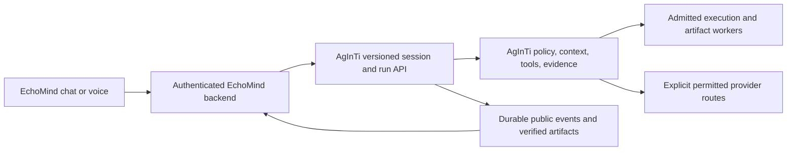

# General Agent Backend Research

Date: 2026-09-27. This is a source-based assessment plus an offline runtime
repair, not a production deployment or a live model-quality benchmark.

## Baseline and Scope

- AgInTiFlow: `bf9c3e0386f86502246e776d25dcf29d43d89216`,
  `integration/deepseek-analysis-20260910`, `0.20.336-integration.4`.
- Implementation branch: `fix/provider-request-lifecycle-20260927`, in
  `AgInTiFlow-worktrees/AgInTiFlow-runtime-responsiveness`.
- AgenticApp reference HEAD: `7465ec7eece9ef92111ab28284fd7d54c2b2c8be`.
  Its current source and handoffs were read; its unrelated dirty work was preserved.
- EchoMind reference HEAD: `190aeb3325dec6f5d31c56be80ed4f0b35d86f13`.
  Its provider factory, conversation, voice, and single-flight code were read.
- No private conversation bodies, credentials, or model weights were required.
  No application services, GPU jobs, provider defaults, or public routes were changed.

The existing SQLite campaign was opened read-only. It contains 69 capability
rows (6 passed, 63 passed-after-fix) and 114 test rows (8 passed, 104
passed-after-fix, 2 historical failures). Its latest recorded scenarios use
0.20.331-era versions. This is substantial regression evidence, but does not
establish current integration performance or universal task coverage. The
new request-lifecycle regression is separate evidence, not a rewritten old pass.

## What Already Works Architecturally

AgenticApp's `src/agenticapp/workspace_agent.py::run_aginti_turn` locks its
conversation registry, selects a persistent AgInTi session, and invokes the
machine CLI. `_run_aginti_provider_chain` preserves that session when changing
provider. `_parse_aginti_machine_result` treats stopped, failed, or unresolved
tool-protocol output as failure. The host registers actual artifact files;
an assistant mentioning a file is insufficient.

Its `references/aginti-primary-labcanvas-agent-handoff-2026-08-18.md` explicitly
assigns mature domain routines to their owning applications. This is the right
general boundary: AgInTi interprets, chooses tools, retains execution context,
and verifies completion. Applications own account policy, domain APIs, delivery,
and authorization of irreversible actions. Their chat names, schedules, and
private transport details should not enter AgInTi's core.

AgInTi already has mechanisms worth retaining:

| Need | Existing implementation | Validation used in this slice |
| --- | --- | --- |
| Provider handoff without restarting the task | `src/provider-handoff.js`, `src/agent-runner.js` | `smoke:provider-handoff` |
| Provider-aware context budgets | `src/context-budget-controller.js` | `smoke:context-budget-recovery` |
| Bounded tool disclosure and convergence | `src/progressive-tool-selection.js` | `eval:local-first-agent` |
| Persistent session, inbox, and crash replay | `src/session-store.js`, `src/session-runtime.js` | `smoke:session-runtime`, `smoke:runtime-core`, `smoke:inbox` |
| Evidence-backed completion | `src/scs-evidence.js`, `src/agent-runner.js` | `smoke:truthful-completion` |
| Scoped research, computation, documents, and artifacts | `src/integration-analysis-planner.js`, `src/integration-analysis-session-service.js` | `smoke:integration-analysis-planner` |
| Server-owned public authority | `src/integration-api.js`, `src/integration-auth.js`, `src/integration-policy.js` | Retain existing readiness and ownership gates |

The public analysis planner and the broad workspace runtime have different tool
surfaces. EchoMind must consume the declared public capability surface; it must
not assume that a CLI tool available on a developer workstation is a public
application capability.

## Upstream Comparison

Existing clean reference checkouts were updated with fast-forward-only pulls,
with Git hooks and recursive submodule updates disabled. No upstream code was
copied into AgInTi and no upstream dependency installation was performed.

| Reference | Inspected revision | Relevant source and lesson |
| --- | --- | --- |
| OpenAI Codex | `41f9084b30812db321a0b592def4f500d1e79cf4` | `codex-rs/core/src/client.rs`, cancellation tokens and consumer-drop handling; `codex-rs/history/src/compaction_checkpoint.rs`, durable context boundaries |
| Claude Code | `7779afb12e3635f46f56ec823979d68350ae000b` | Public plugins and hook examples only; this checkout is not evidence of its proprietary runtime implementation |
| Gemini CLI | `2fe7c2d3f065dc40ad573d50b2091116f8a4aa18` | `packages/core/src/utils/retry.ts`, abort-aware retries; `packages/core/src/telemetry/`, stage-specific observations |
| Qwen Code | `36710ff6908c96a4b95db59c2f46c2b49278d02e` | `packages/core/src/utils/retry.ts`, cancellable delay and explicit retry policy |
| GitHub Copilot SDK | `d106d29dc6c5112da2abdae59008571b6692f12b` | `nodejs/src/session.ts::awaitWorkflowOperation`, guard before dispatch and abort race; `docs/features/session-persistence.md`, explicit session lifecycle |
| DeepSeek Harness | `99f6f02fecdb7dff40c3fbc9470f5907c29f74ca` | Pull timed out twice; existing `docs/agent-lifecycle.zh.md` describes durable session events separately from live coordination. This is a dated reference, not a verified current upstream snapshot. |

The reusable lesson is explicit lifecycle control, not more agents per task.
Anthropic's [context-engineering guidance](https://www.anthropic.com/engineering/effective-context-engineering-for-ai-agents)
supports selective retrieval, small clear tool surfaces, and preserving important
state during compaction. AgInTi already implements parts of this; improve their
measured behavior before adding more prompts or parallel workers.

[Gemini's telemetry documentation](https://geminicli.com/docs/cli/telemetry/)
provides a useful reference for separating model, tool, and agent observations.
Apply that idea with private-content logging disabled, rather than copying a
telemetry service or transmitting user data.

## Reproduced Defect and Implemented Repair

`src/model-client.js::createChatCompletion` bounded the first SDK call using
`Promise.race`, but awaited its unsupported-`reasoning_effort` compatibility
retry directly. The deadline still aborted a signal, yet the caller could remain
waiting and accept a late success. Caller cancellation similarly depended on
the client settling itself, rather than ending AgInTi's wait.

Before editing, a controlled client reproduced a retry still pending 80 ms after
a 25 ms deadline and then returning success. Eight deterministic tests were
added; six failed on the original source. A real OpenAI SDK instance with an
offline fetch implementation also reproduced the problem when the compatibility
retry entered a 429 Retry-After backoff. No provider request was transmitted.

The repair uses one shared deadline and cancellation outcome for both attempts:

- Already-cancelled work makes zero client calls.
- Caller cancellation ends the wait and sends abort to the transport.
- Both attempts share the original deadline; retry does not restart the clock.
- Late resolution cannot replace cancellation or timeout with success.
- Cancellation cannot trigger another compatibility attempt.
- Timers and parent listeners are removed after completion or failure.
- The optional compatibility retry, normal payloads, and provider-error metadata
  remain intact. Existing timeout classification can still drive permitted
  same-session handoff.

This improves a demonstrated waiting failure. It does not make the underlying
model generate tokens faster, guarantee a remote provider stopped computing,
or eliminate an SDK-owned backoff timer. The latter is drained in the regression
and cannot issue another fetch after abort. It also does not change the separate
public analysis planner's own model-request lifecycle.

## Smallest EchoMind Integration

The inspected EchoMind `EchoMind/echomind/ai_client_factory.py` and
`mixed_ai_request.py` create provider clients. `voice_processor.py::get_ai_response`
uses schema-constrained responses, conversation context, and single-flight
deduplication; `process_audio` calls it through an executor. This is not yet a
durable AgInTi task interface, and replacing a provider URL cannot provide one.

Recommended boundary for a subsequent, separately tested integration:

Bind each user/conversation to an owned thread, preserve the same run/session
through reconnect and permitted provider handoff, and use mutation idempotency.
Use persisted run events for progress and replay. A stop request should cancel
the scoped run; a disconnected phone should not create a second task. Keep
speech recognition, TTS, language settings, notifications, and social features
in EchoMind. Add capabilities incrementally: text-only inference, source-backed
research, then admitted file/computation work.

`safe-chat` is a bounded stateless response service, not a substitute for this
session API. Its prose documentation predates the provider-general code, so
effective source configuration and capability probes must take precedence over
old DeepSeek-only examples. No EchoMind wiring or deployment was attempted here.

## Prioritized Next Work

1. **Measure latency without prompts in telemetry.** Correlate queue admission,
   readiness, model attempts, retries, tools, validation, and terminal commit.
   Existing `model.requested` events do not by themselves describe every SDK
   attempt or first-token delay. Track p50/p95, request/tool counts, and repair
   count per task class before claiming speed improvements.
2. **Turn routine reuse into explicit capability contracts.** Reuse the existing
   skill/profile/tool mechanisms. Domain owners provide bounded inputs, scope,
   side-effect class, cancellation, output manifest, and verifier. The runtime
   should not rediscover an entire repository after receiving an authoritative
   routine that already answers the request.
3. **Test the application adapter under real lifecycle failures.** Phone
   reconnect, duplicate submit, cancellation, provider outage, worker restart,
   ownership conflicts, and response loss must preserve one durable task and
   verified outputs. Never replay a side-effecting tool turn as a fresh prompt.
4. **Make perceived progress honest.** Expose stage and verified tool progress
   early. If draft text is streamed later, mark it provisional and retain the
   existing evidence gates before accepting a final answer or artifact.
5. **Expand measured coverage, not permissions.** Reuse narrow application
   routines for CAD, media, research, and documents. Unsupported host actions
   should remain explicit capability limits. Worker readiness and optional-role
   degradation must remain truthful.

Suggested acceptance prompts are ordinary, imperfect requests: summarize notes
without writing files; correct a prior answer in the same thread; inspect an
already-specified read-only routine; research a topic using both official web
and paper sources; calculate a result and create exactly the requested files;
cancel while a provider is retrying; reconnect after artifact commit without
repeating the work. Verify files and durable state from outside the agent.

No current live DeepSeek/LocalLLM latency or quality claim is made. Broad
production readiness still requires these app-level canaries and configured
capability proofs. A passing offline regression is evidence for its exact
contract, not a claim that all repositories or tasks now work perfectly.

## Validation Record

- `node --test test/model-request-lifecycle.test.js`: 8 passed. Before the
  repair, the same file produced 6 failures and 2 passes.
- `npm run smoke:model-roles`: passed, including the new regression file.
- `npm run smoke:provider-handoff`: passed with persisted mock-provider runs.
- Separate focused passes: `smoke:local-failure-recovery`,
  `smoke:context-budget-recovery`, `smoke:session-runtime`, `smoke:runtime-core`,
  `smoke:inbox`, `smoke:truthful-completion`, and
  `smoke:integration-analysis-planner`.
- `npm run eval:local-first-agent`: 18 passed, 0 failed, 0 skipped;
  its offline guard observed zero network attempts.
- `npm run check`: 300 JavaScript files passed. The new test file also passed
  its explicit `node --check`.
- `AGINTIFLOW_PROVIDER_ATTRIBUTION_LIVE=0 npm test`: exit 0, including pretest.
  The document-worker-server and document-worker-cross-boundary scripts
  reported occupied-port skips for `127.0.0.1:18102`; its existing listener was
  left untouched. These two HTTP checks are not claimed as executed passes.
- Dry-run npm packaging includes the new regression and excludes private
  session, credential, database, and dependency paths in the inspected file list.
- `git diff --check`: passed.

Tests reused the baseline dependency installation through a temporary symlink;
no dependencies were installed or upgraded. Only task-owned smoke autostart
servers were stopped during cleanup. Package version remains
`0.20.336-integration.4`; no release, deployment, installed-package change, or
EchoMind/AgenticApp source change was performed.
