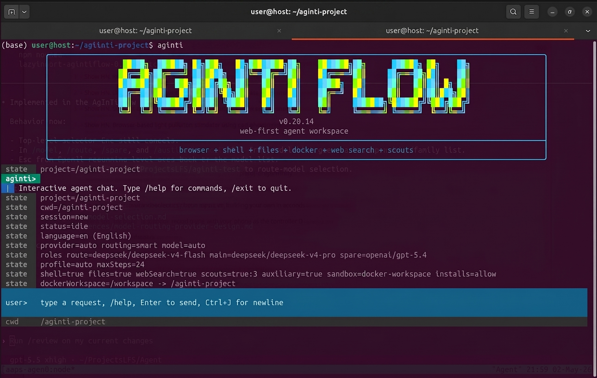
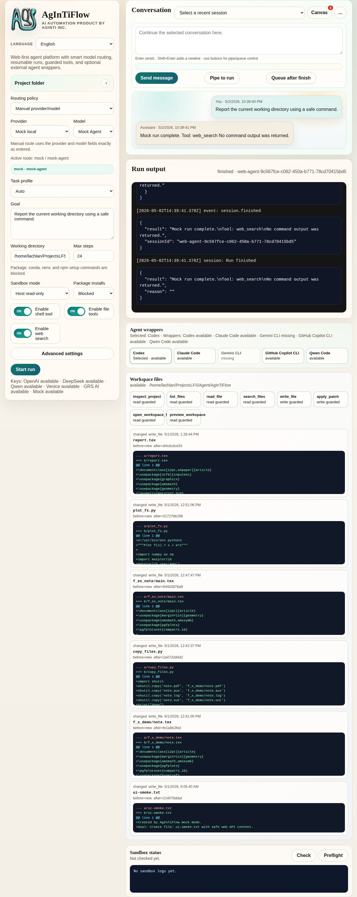
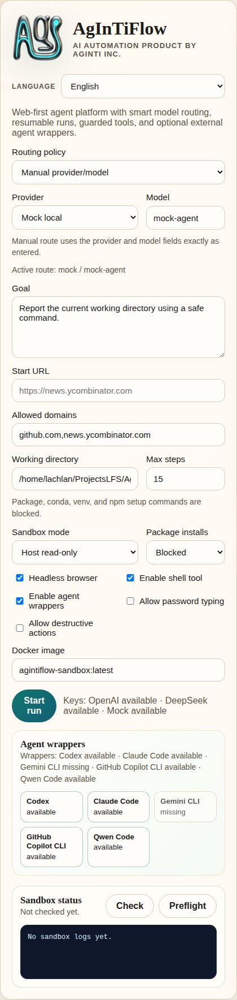
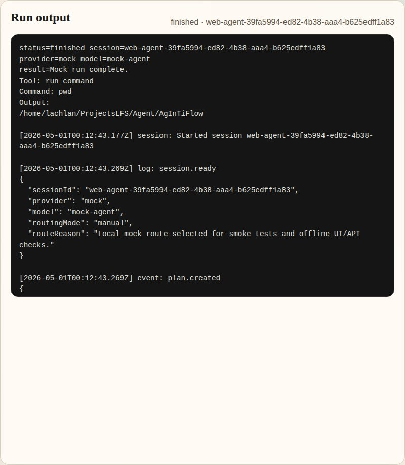
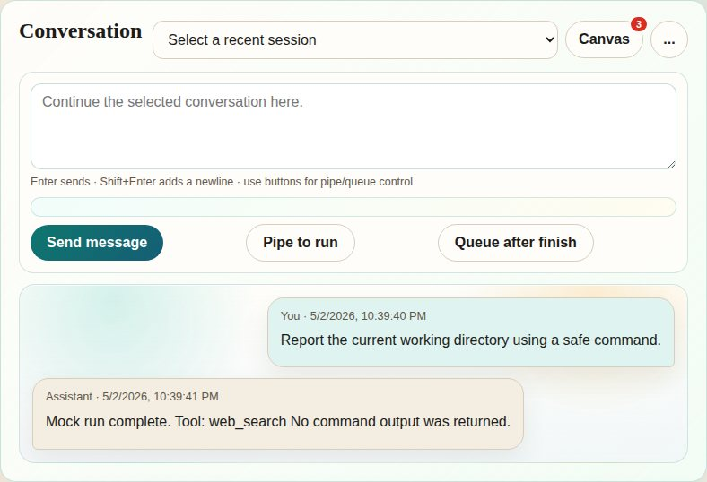
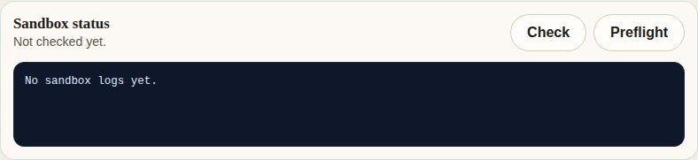
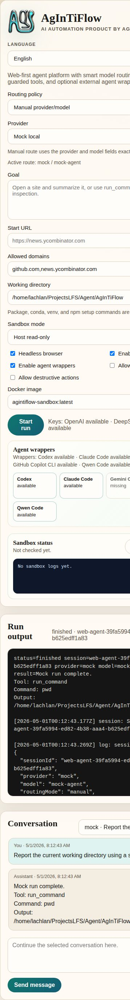

[English](../README.md) · [العربية](README.ar.md) · [Español](README.es.md) · [Français](README.fr.md) · [日本語](README.ja.md) · [한국어](README.ko.md) · [Tiếng Việt](README.vi.md) · [中文 (简体)](README.zh-Hans.md) · [中文（繁體）](README.zh-Hant.md) · [Deutsch](README.de.md) · [Русский](README.ru.md)

<p align="center">
  
</p>

<p align="center">
  
</p>

# AgInTiFlow


**実際の問題に向けた、低コストでプロジェクトを理解するエージェント。**

AgInTiFlow は、ハイブリッド wet-dry R&D、hardware-aware intelligence、ソフトウェア自動化、産業ワークフローのための project-aware agent workspace です。実験計画からデータ解析、ハードウェア制御から生産スクリプト、顕微鏡画像・ドローン・ロボットからレポートまで、SCS 監督、AAPS ワークフロー、保護された実行、永続的な証拠を備えて、API、Web、CLI からエージェントが作業できるようにします。

要するに、プロジェクト内で `aginti` を実行し、タスクを渡し、計画とツール呼び出しを確認し、後で再開し、成果物をワークスペースに残せます。

> **翻訳の更新状況:** この翻訳は、[最新の英語 README](../README.md) と [local-first runtime リファレンス](../docs/local-first-agent-runtime.md) の一部詳細より遅れている場合があります。デフォルトは `http://127.0.0.1:8008/v1` の LocalLLM で、`localllm-fast` と `localllm-deep` を使います。Hosted provider は明示的に選ぶ任意の upgrade です。環境にキーがあるだけでは選択されず、自動 fallback も行いません。補助画像生成も明示的に有効化するまでオフです。

**リンク**

| リソース | URL |
| --- | --- |
| Website | [https://flow.lazying.art](https://flow.lazying.art) |
| GitHub | [https://github.com/lazyingart/AgInTiFlow](https://github.com/lazyingart/AgInTiFlow) |
| npm | [https://www.npmjs.com/package/@lazyingart/agintiflow](https://www.npmjs.com/package/@lazyingart/agintiflow) |
| AAPS npm | [https://www.npmjs.com/package/@lazyingart/aaps](https://www.npmjs.com/package/@lazyingart/aaps) |
| プロダクト定位 | [../references/agintiflow-product-positioning.md](../references/agintiflow-product-positioning.md) |
| 完全版 README アーカイブ | [../references/notes/readme-full-reference-2026-05-05.md](../references/notes/readme-full-reference-2026-05-05.md) |

<p align="center">
  
</p>

## なぜ作るのか

多くのエージェントツールは、状態が見えないチャットボックスか、高価な単一モデルループです。AgInTiFlow は別の考え方で設計されています。

| 原則 | 実際の意味 |
| --- | --- |
| ローカル知能はアーキテクチャを変える | ベースラインは隣接する LocalLLM gateway を使い、route と main をローカルかつプライベートに実行します。Hosted model は明示的な upgrade のままです。 |
| 謎より検査可能性 | 計画、ツール呼び出し、ファイル diff、コマンド出力、キャンバス成果物、セッションイベントは保存され、再開できます。 |
| ロール別モデル | route、main、spare、wrapper、auxiliary image は別ロールです。LocalLLM の Fast/Deep がデフォルトで、DeepSeek、OpenAI、OpenRouter、Qwen、Venice は明示的に選択します。 |
| 大きな作業の前に scouts | 並列 scouts がアーキテクチャ、テスト、リスク、シンボル、統合点を安く調査してから、メイン実行器が編集します。 |
| 高リスク作業には SCS | Student-Committee-Supervisor モードは型付きゲートを追加します。committee が起案し、student が承認/監視し、supervisor が実行します。`/scs` または `--scs auto` を使います。 |
| 大規模ワークフローには AAPS | AAPS はトップダウンのエージェントパイプラインスクリプトを記述します。AgInTiFlow はその検証、コンパイル、実行を行う対話型バックエンドになります。 |
| ローカル安全がデフォルト | Docker workspace、パスガード、シークレットの redact、npm publish/token コマンドのブロック、可視ログにより、実用性と透明性を両立します。 |

## クイックスタート

インストールしてプロジェクトを開きます。

```bash
npm install -g @lazyingart/agintiflow
cd /path/to/your-project
aginti init
aginti
```

AgInTiFlow はデフォルトで Hosted key を必要とせず、`http://127.0.0.1:8008/v1` の隣接 LocalLLM service に接続します。route は `localllm-fast`、main は `localllm-deep` です。DeepSeek、OpenAI、OpenRouter、Qwen、Venice を使う場合だけ provider を明示的に選び、auth wizard を実行します。LocalLLM の失敗時は明確なエラーで停止し、タスクを自動的に cloud へ送りません。

```bash
aginti auth
aginti auth deepseek
aginti auth openrouter
aginti auth venice
aginti login grsai
```

保存済み Hosted key は認証にだけ使われ、active provider を変更しません。補助画像ツールは `/auxiliary on`、`/auxiliary image`、または同等の toggle を明示的に使うまでオフです。

同じプロジェクトから Web UI を起動します。

```bash
aginti web --port 3210
# open http://127.0.0.1:3210
```

実モデルの認証情報なしで smoke test を実行します。

```bash
aginti --provider mock --routing manual --allow-file-tools "Create notes/hello.md with a smoke-test note"
```

明示的に言語を指定するか、省略してシステム locale に従います。

```bash
aginti --language ja
aginti --language zh-Hans
aginti --language de
```

## 日常コマンド

| 目的 | コマンド |
| --- | --- |
| 対話チャットを開始 | `aginti` または `aginti chat` |
| ローカル Web アプリを開始 | `aginti web --port 3210` |
| provider キーを保存 | `aginti auth`, `/auth`, `/login` |
| 現在の repo をレビュー | `/review [focus]` |
| SCS 品質ゲートを切り替え | `/scs` |
| 複雑な作業だけ SCS を使う | `/scs auto` または `aginti --scs auto "task"` |
| AAPS ワークフローを扱う | `aginti aaps status`, `/aaps validate` |
| モデルを選ぶ | `/route`, `/model`, `/spare`, `/wrapper`, `/auxiliary model` |
| Venice ショートカット | `/venice` |
| 画像を生成 | `/auxiliary image` の後に画像を依頼 |
| 現在のプロジェクトを再開 | `aginti resume` |
| 全セッションを表示 | `aginti resume --all-sessions` |
| 実行中セッションへキュー | `aginti queue <session-id> "extra instruction"` |
| 空セッションを削除 | `aginti --remove-empty-sessions` |
| 能力を確認 | `aginti capabilities`, `aginti doctor --capabilities` |
| レビュー済みスキルを同期 | `aginti skillmesh status`, `aginti skillmesh sync` |
| CLI を更新 | `aginti update` |

対話チャットは slash 補完、Up/Down セレクタ、`Ctrl+J` の複数行入力、完全な再開履歴、Markdown 表示、可視の実行状態、実行中の ASAP pipe メッセージ、`Ctrl+C` による安全な中断/再開をサポートします。インストール済みの対話コマンドは npm の新バージョンも確認し、更新/スキップの選択を表示します。ソース checkout と非 TTY 自動化はそのままです。

完全に制御された一回限りの再開では、明示的な session id と task profile を指定します。通常ルーティングは `auto`、Android/エミュレータ作業は `android` を使います。

```bash
PROFILE=android  # or auto
aginti --resume <session-id> \
  --profile "$PROFILE" \
  --sandbox-mode host \
  --package-install-policy allow \
  --approve-package-installs \
  --allow-shell \
  --allow-file-tools \
  --allow-destructive \
  "Take a fresh screenshot of the running app in the emulator, save it with a durable filename in this project, and keep git status clean."
```

## 実際のスクリーンショット

| CLI 起動 | Web アプリ概要 |
| --- | --- |
|  |  |

| タスク操作 | 実行出力 |
| --- | --- |
|  |  |

| 会話履歴 | サンドボックス状態 |
| --- | --- |
|  |  |

| モバイル概要 |
| --- |
|  |

古い起動スクリーンショットはソース repo の [demos/archive/](https://github.com/lazyingart/AgInTiFlow/tree/main/demos/archive) にあります。

## 主な機能

| 機能 | AgInTiFlow が提供するもの |
| --- | --- |
| CLI エージェントワークスペース | プロジェクト cwd、セッション再開、可視モデル/ツール状態、明確なコマンドヒントを持つ永続ターミナルチャット。 |
| ローカル Web ワークスペース | セッション、実行ログ、成果物、モデル設定、プロジェクト操作、キャンバスプレビュー、サンドボックス状態の UI。 |
| ファイルツール | `inspect_project`, `list_files`, `read_file`, `search_files`, `write_file`, `apply_patch`, `open_workspace_file`, `preview_workspace`。 |
| Shell ツール | host または Docker workspace の保護された shell 実行。パッケージ導入ポリシーとコマンド安全チェック付き。 |
| ブラウザツール | Playwright ブラウザ操作。遅延起動と任意のドメイン allowlist。 |
| モデルルーティング | LocalLLM Fast/Deep がデフォルトです。DeepSeek、OpenAI、OpenRouter、Qwen、Venice、mock は明示的な route で、環境キーによる Hosted fallback はありません。 |
| Patch ワークフロー | Codex 形式 patch envelope、unified diff、正確な置換、hash、コンパクト diff、パスガード。 |
| 並列 scouts | アーキテクチャ、実装、レビュー、テスト、git、研究、シンボル追跡、依存リスクを調べる任意の scout 呼び出し。 |
| SCS モード | 複雑またはリスクの高いタスク向けの Student-Committee-Supervisor 品質ゲート。 |
| AAPS adapter | `.aaps` ワークフローの init、validate、parse、compile、dry-run、run 用の任意 `@lazyingart/aaps` 統合。 |
| 画像生成 | GRS AI と Venice はデフォルトでオフです。明示的な有効化が必要で、キーを保存しただけでは有効化や代替 provider の選択を行いません。 |
| スキルライブラリ | コード、Web、Android/iOS、Python、Rust、Java、LaTeX、執筆、レビュー、GitHub、AAPS などの Markdown スキル。 |
| Skill Mesh | レビュー済み再利用スキルパックの厳格な記録/共有。使わない場合はバックグラウンド共有なしで通常動作します。 |
| 多言語 UI | CLI とドキュメントは英語、日本語、簡体/繁体中国語、韓国語、フランス語、スペイン語、アラビア語、ベトナム語、ドイツ語、ロシア語をサポートします。 |

## モデルとロール

AgInTiFlow は「モデル」を単一のグローバル設定として扱いません。ロールがあります。

| ロール | デフォルト | 用途 |
| --- | --- | --- |
| Route | `localllm/localllm-fast` | ローカルの計画、トリアージ、短いタスク、ルーティング判断。 |
| Main | `localllm/localllm-deep` | 複雑なコーディング、デバッグ、執筆、研究、長いタスクのローカル実行。 |
| Spare | `localllm/localllm-deep` medium | ローカルのクロスチェック。Hosted spare は明示的な選択が必要です。 |
| Wrapper | `codex/gpt-5.5` medium | 任意の外部 coding-agent アドバイザ。 |
| Auxiliary | `grsai/nano-banana-2` (off) | 明示的に有効化した画像生成と非テキストツールのみ。キーによる provider failover はありません。 |

よく使うセレクタ：

```text
/models
/route
/model
/spare
/wrapper
/auxiliary model
/venice
```

Venice は任意の uncensored または制限の少ない創作作業に使えます。LocalLLM がローカルのデフォルトであり、DeepSeek などの Hosted provider は明示的な upgrade に限られます。詳しくは [../docs/model-selection.md](../docs/model-selection.md)、[../docs/local-first-agent-runtime.md](../docs/local-first-agent-runtime.md)、[../references/venice-model-reference.md](../references/venice-model-reference.md) を参照してください。

## AAPS と大規模ワークフロー

AAPS は pipeline-script 層で、AgInTiFlow は対話型エージェント/ツールバックエンドです。

```bash
aginti aaps status
aginti aaps init "Project Workflow"
aginti aaps validate
aginti aaps compile check
```

チャット内：

```text
/aaps on
/aaps validate
/aaps dry-run workflows/main.aaps
```

単一チャットより大きなタスクでは AAPS を使います。段階付きアプリ開発、論文/書籍ワークフロー、検証ゲート、回復手順、成果物生成、トップダウンのエージェントスクリプトに向いています。詳しくは [../docs/aaps.md](../docs/aaps.md) と package [https://www.npmjs.com/package/@lazyingart/aaps](https://www.npmjs.com/package/@lazyingart/aaps) を参照してください。

## ローカル API 早見表

Web アプリは UI と自動化のためのローカル API を公開します。これらの endpoint は状態を返しますが、生の API key や npm token は公開しません。

```bash
curl http://127.0.0.1:3210/api/config
curl http://127.0.0.1:3210/api/capabilities
curl http://127.0.0.1:3210/api/sandbox/status
curl -X POST http://127.0.0.1:3210/api/sandbox/preflight \
  -H 'Content-Type: application/json' \
  -d '{"sandboxMode":"docker-workspace","buildImage":true}'
curl http://127.0.0.1:3210/api/workspace/changes
curl "http://127.0.0.1:3210/api/sessions/<session-id>/artifacts"
curl "http://127.0.0.1:3210/api/sessions/<session-id>/inbox"
```

認証情報なしの API smoke test：

```bash
npm run smoke:web-api
```

## ストレージ、安全、再開

AgInTiFlow は canonical session を中央に保存し、プロジェクト側にはローカルポインタだけを置きます。

| 場所 | 目的 |
| --- | --- |
| `~/.agintiflow/sessions/<session-id>/` | canonical 状態、イベント、ブラウザ状態、成果物、スナップショット、キャンバスファイル。 |
| `<project>/.aginti-sessions/` | プロジェクトローカルの session pointer と Web UI データベース。git ignore。 |
| `<project>/.aginti/.env` | 任意のプロジェクトローカル API key。権限制限付き。git ignore。 |
| `<project>/AGINTI.md` | 編集可能なプロジェクト指示と永続ローカル設定。シークレットがなければ commit 可能。 |

安全デフォルト：

- Docker workspace mode は通常の CLI/Web コーディングと成果物生成のデフォルトです。
- ファイルツールは secret らしいパス、`.env`、`.git`、`node_modules` 書き込み、絶対パス脱出、巨大ファイル、バイナリ編集をブロックします。
- Shell コマンドはポリシーチェックされます。npm publish、npm token、sudo、破壊的 git、認証情報読み取りはブロックされます。
- ファイル書き込みは hash とコンパクト diff を記録します。
- ツール呼び出しと結果は構造化 session events に記録されます。
- Web と CLI は同じ session store を使うため、後で検査・再開できます。

詳細は [../docs/runtime-modes-and-autonomy.md](../docs/runtime-modes-and-autonomy.md)、[../docs/patch-tools.md](../docs/patch-tools.md)、[../docs/agent-runtime-pipe.md](../docs/agent-runtime-pipe.md) を参照してください。

## 設定

よく使う環境変数：

```bash
AGENT_PROVIDER=localllm
LOCALLLM_BASE_URL=http://127.0.0.1:8008/v1
LOCALLLM_API_KEY=local-dev-key
AGINTI_LOCALLLM_ROUTE_MODEL=localllm-fast
AGINTI_LOCALLLM_MAIN_MODEL=localllm-deep

# 任意かつ明示的な hosted upgrade。LocalLLM から自動 fallback しません。
DEEPSEEK_API_KEY=...
OPENAI_API_KEY=...
OPENROUTER_API_KEY=...
QWEN_API_KEY=...
VENICE_API_KEY=...
GRSAI_API_KEY=...
AGENT_ROUTING_MODE=smart
AGINTI_TASK_PROFILE=auto
AGINTI_LANGUAGE=en
SANDBOX_MODE=docker-workspace
PACKAGE_INSTALL_POLICY=allow
COMMAND_CWD=/path/to/project
```

プロジェクトローカルキー：

```bash
aginti init
printf '%s' "$DEEPSEEK_API_KEY" | aginti keys set deepseek --stdin
printf '%s' "$VENICE_API_KEY" | aginti keys set venice --stdin
```

詳細：

- [../docs/model-selection.md](../docs/model-selection.md)
- [../docs/auxiliary-image-generation.md](../docs/auxiliary-image-generation.md)
- [../docs/cli-i18n.md](../docs/cli-i18n.md)
- [../docs/skillmesh.md](../docs/skillmesh.md)

## ドキュメントマップ

| トピック | リンク |
| --- | --- |
| AAPS adapter | [../docs/aaps.md](../docs/aaps.md) |
| モデル選択とロール | [../docs/model-selection.md](../docs/model-selection.md) |
| SCS モード | [../docs/student-committee-supervisor.md](../docs/student-committee-supervisor.md) |
| 大規模コードベース開発 | [../docs/large-codebase-engineering.md](../docs/large-codebase-engineering.md) |
| 実行モードと自律性 | [../docs/runtime-modes-and-autonomy.md](../docs/runtime-modes-and-autonomy.md) |
| スキルとツール | [../docs/skills-and-tools.md](../docs/skills-and-tools.md) |
| Skill Mesh | [../docs/skillmesh.md](../docs/skillmesh.md) |
| Housekeeping logs | [../docs/housekeeping.md](../docs/housekeeping.md) |
| npm publishing | [../docs/npm-publishing.md](../docs/npm-publishing.md) |
| Product roadmap | [../docs/productive-agent-roadmap.md](../docs/productive-agent-roadmap.md) |
| Supervised capability curriculum | [../docs/supervised-capability-curriculum.md](../docs/supervised-capability-curriculum.md) |
| 古い完全版 README 参考 | [../references/notes/readme-full-reference-2026-05-05.md](../references/notes/readme-full-reference-2026-05-05.md) |

## 開発

ソースから実行：

```bash
git clone https://github.com/lazyingart/AgInTiFlow.git
cd AgInTiFlow
npm install
npx playwright install chromium
npm run check
npm test
```

ソースからローカル Web を起動：

```bash
npm run web
# open http://127.0.0.1:3210
```

便利な smoke checks：

```bash
npm run smoke:web-api
npm run smoke:coding-tools
npm run smoke:aaps-adapter
npm run smoke:cli-chat
npm run smoke:toolchain-docker
```

smoke scripts は、明示的に real-provider test と書かれていない限り、ローカル mock provider を使います。

## リリースノート

AgInTiFlow は `@lazyingart/agintiflow` として公開されています。推奨リリース手順は npm provenance 付き GitHub Actions Trusted Publishing です。ローカルトークン公開は bootstrap の fallback に限り、`.env`、`.npmrc`、npm token、OTP、debug logs を絶対に commit しないでください。

完全なリリース手順は [../docs/npm-publishing.md](../docs/npm-publishing.md) を参照してください。

## サポート

このプロジェクトが役に立つ場合は、以下から開発を支援できます。

| Support | URL |
| --- | --- |
| GitHub Sponsors: LazyingArt | [https://github.com/sponsors/lazyingart](https://github.com/sponsors/lazyingart) |
| GitHub Sponsors: Lachlan Chen | [https://github.com/sponsors/lachlanchen](https://github.com/sponsors/lachlanchen) |
| LazyingArt | [https://lazying.art](https://lazying.art) |
| Chat | [https://chat.lazying.art](https://chat.lazying.art) |
| OnlyIdeas | [https://onlyideas.art](https://onlyideas.art) |

AgInTiFlow は AgInTi Lab, LazyingArt LLC により開発されています。
