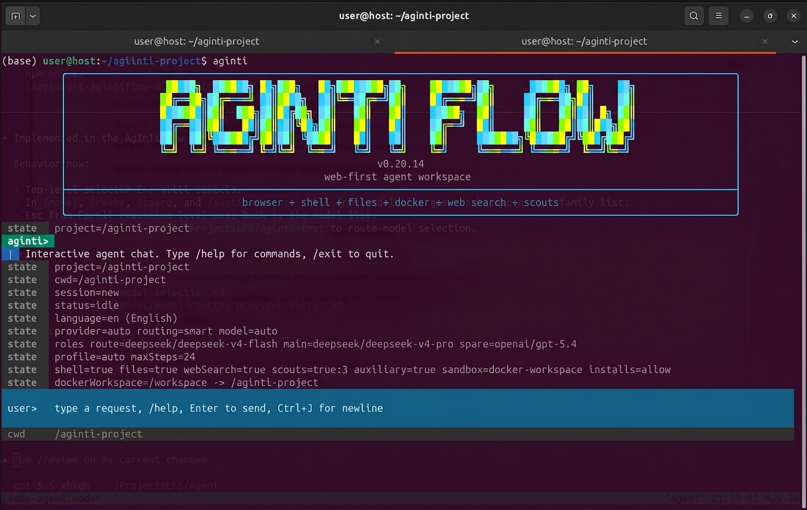
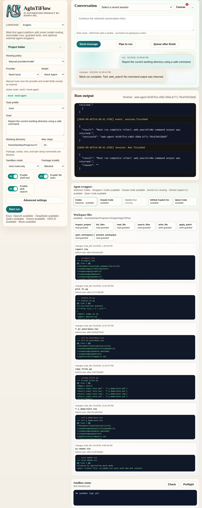
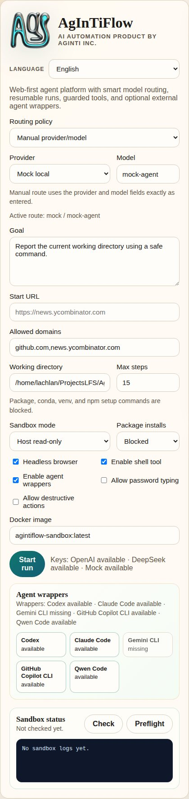
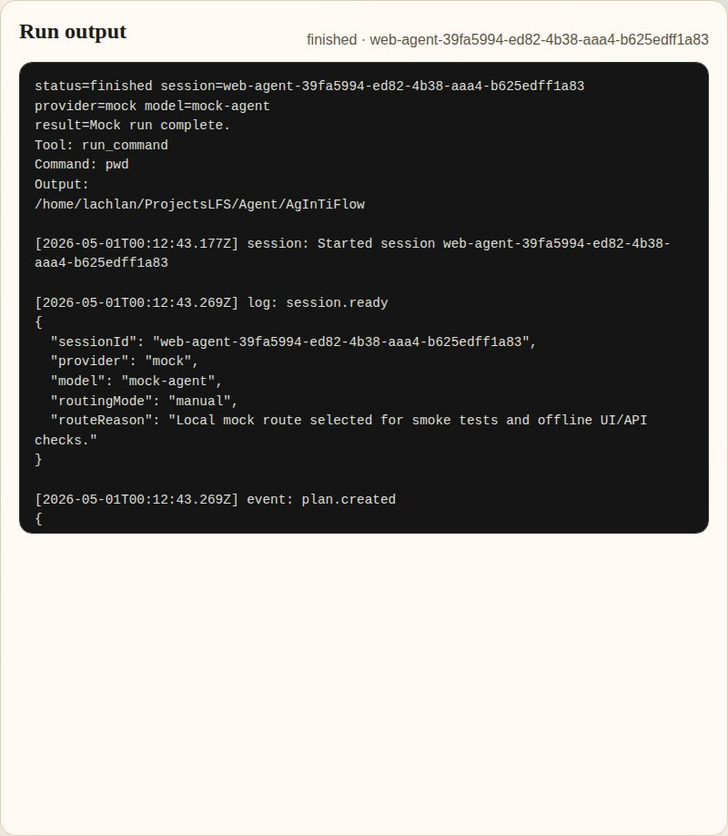
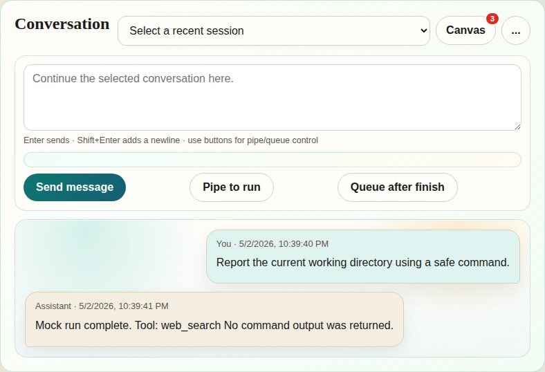
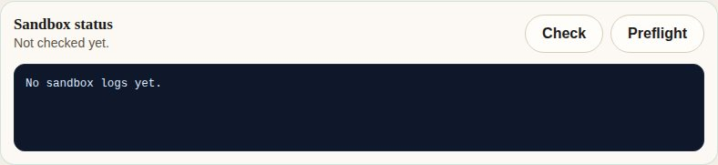
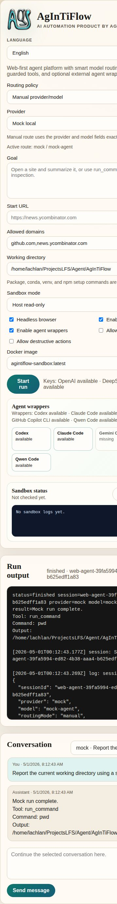

[English](../README.md) · [العربية](README.ar.md) · [Español](README.es.md) · [Français](README.fr.md) · [日本語](README.ja.md) · [한국어](README.ko.md) · [Tiếng Việt](README.vi.md) · [中文 (简体)](README.zh-Hans.md) · [中文（繁體）](README.zh-Hant.md) · [Deutsch](README.de.md) · [Русский](README.ru.md)

<p align="center">
  
</p>

<p align="center">
  
</p>

# AgInTiFlow


AgInTiFlow 是一个面向真实项目文件夹的本地 Web 与 CLI 智能体工作区。它把低成本模型路由、可检查的工具调用、可持久化会话、受保护的文件/shell/浏览器操作、可选图像生成，以及结构化的大任务监督组合在一起。

简短理解：在项目目录里运行 `aginti`，交给它一个任务，检查它的计划，看到每一次工具调用，之后还能恢复会话，并把输出保留在你的工作区里。

**链接**

| 资源 | URL |
| --- | --- |
| 网站 | [https://flow.lazying.art](https://flow.lazying.art) |
| GitHub | [https://github.com/lazyingart/AgInTiFlow](https://github.com/lazyingart/AgInTiFlow) |
| npm | [https://www.npmjs.com/package/@lazyingart/agintiflow](https://www.npmjs.com/package/@lazyingart/agintiflow) |
| AAPS npm | [https://www.npmjs.com/package/@lazyingart/aaps](https://www.npmjs.com/package/@lazyingart/aaps) |
| 完整归档 README 参考 | [../references/notes/readme-full-reference-2026-05-05.md](../references/notes/readme-full-reference-2026-05-05.md) |

<p align="center">
  
</p>

## 为什么存在

大多数智能体工具要么只是一个带隐藏状态的聊天框，要么是一个昂贵的单模型循环。AgInTiFlow 采用另一种设计哲学：

| 原则 | 实际含义 |
| --- | --- |
| 便宜的智能会改变架构 | DeepSeek V4 Flash 和 Pro 让路由、侦察、审查、恢复这些额外调用变得现实，而不是强迫一个昂贵调用完成所有事情。 |
| 可检查胜过神秘 | 计划、工具调用、文件 diff、命令输出、画布产物和会话事件都会保存，并可恢复。 |
| 基于角色的模型 | route、main、spare、wrapper、auxiliary image 是分开的角色。你可以用便宜路由模型、更强主模型、可选 OpenAI/Qwen/Venice 路线，以及 GRS AI/Venice 图像工具。 |
| 大任务前先 scouts | 并行 scouts 可以低成本绘制架构、测试、风险、符号和集成点，然后主执行器再编辑文件。 |
| SCS 用于高风险工作 | Student-Committee-Supervisor 模式增加类型化关卡：committee 起草，student 批准/监控，supervisor 执行。使用 `/scs` 或 `--scs auto`。 |
| AAPS 用于大型流程 | AAPS 描述自顶向下的智能体流水线脚本；AgInTiFlow 可以作为交互式后端验证、编译和执行这些流程。 |
| 默认本地安全 | Docker workspace、路径保护、密钥脱敏、阻止 npm publish/token 命令、可见日志，让智能体实用但不黑箱。 |

## 快速开始

安装并打开一个项目：

```bash
npm install -g @lazyingart/agintiflow
cd /path/to/your-project
aginti init
aginti
```

第一次交互式使用时，如果找不到主模型密钥，AgInTiFlow 会打开认证向导。选择 DeepSeek、OpenAI、Qwen 或 Venice，粘贴密钥，它会保存到被忽略的项目本地 `.aginti/.env` 文件，并使用受限权限。你可以随时重新运行设置：

```bash
aginti auth
aginti auth deepseek
aginti auth venice
aginti login grsai
```

从同一项目启动 Web UI：

```bash
aginti web --port 3210
# open http://127.0.0.1:3210
```

没有真实模型凭据时也可以用本地 mock 做冒烟测试：

```bash
aginti --provider mock --routing manual --allow-file-tools "Create notes/hello.md with a smoke-test note"
```

显式指定语言，或省略以跟随系统 locale：

```bash
aginti --language ja
aginti --language zh-Hans
aginti --language de
```

## 日常命令

| 目标 | 命令 |
| --- | --- |
| 启动交互式聊天 | `aginti` 或 `aginti chat` |
| 启动本地 Web 应用 | `aginti web --port 3210` |
| 保存 provider 密钥 | `aginti auth`, `/auth`, `/login` |
| 审查当前仓库 | `/review [focus]` |
| 切换 SCS 质量关卡 | `/scs` |
| 仅在复杂任务使用 SCS | `/scs auto` 或 `aginti --scs auto "task"` |
| 使用 AAPS 流程 | `aginti aaps status`, `/aaps validate` |
| 选择模型 | `/route`, `/model`, `/spare`, `/wrapper`, `/auxiliary model` |
| 启用 Venice 快捷模式 | `/venice` |
| 生成图像 | `/auxiliary image`，然后描述图像需求 |
| 恢复当前项目 | `aginti resume` |
| 浏览全部会话 | `aginti resume --all-sessions` |
| 向运行中会话排队 | `aginti queue <session-id> "extra instruction"` |
| 清理空会话 | `aginti --remove-empty-sessions` |
| 检查能力 | `aginti capabilities`, `aginti doctor --capabilities` |
| 同步已审查技能 | `aginti skillmesh status`, `aginti skillmesh sync` |
| 更新 CLI | `aginti update` |

交互式聊天支持 slash 补全、Up/Down 选择器、用 `Ctrl+J` 输入多行、完整恢复历史、Markdown 渲染、可见运行状态、运行期间的 ASAP pipe 消息，以及用 `Ctrl+C` 干净中断/恢复。已安装的交互命令还会检查 npm 上是否有新版本，并显示更新/跳过选择器；源码 checkout 和非 TTY 自动化不会被打扰。

如果需要完全可控的一次性恢复，使用显式 session id，并主动选择任务 profile。普通路由用 `auto`，Android/模拟器相关工作用 `android`：

```bash
PROFILE=android  # or auto
aginti --resume <session-id> \
  --profile "$PROFILE" \
  --sandbox-mode host \
  --package-install-policy allow \
  --approve-package-installs \
  --allow-shell \
  --allow-file-tools \
  --allow-destructive \
  "Take a fresh screenshot of the running app in the emulator, save it with a durable filename in this project, and keep git status clean."
```

## 真实截图

| CLI 启动 | Web 应用概览 |
| --- | --- |
|  |  |

| 任务控制 | 运行输出 |
| --- | --- |
|  |  |

| 对话历史 | 沙箱状态 |
| --- | --- |
|  |  |

| 移动端概览 |
| --- |
|  |

旧版启动截图保留在源码仓库的 [demos/archive/](https://github.com/lazyingart/AgInTiFlow/tree/main/demos/archive)。

## 核心能力

| 能力 | AgInTiFlow 提供什么 |
| --- | --- |
| CLI 智能体工作区 | 持久终端聊天，带项目 cwd、会话恢复、可见模型/工具状态和清晰命令提示。 |
| 本地 Web 工作区 | 浏览器 UI，包含会话、运行日志、产物、模型设置、项目控制、画布预览和沙箱状态。 |
| 文件工具 | `inspect_project`, `list_files`, `read_file`, `search_files`, `write_file`, `apply_patch`, `open_workspace_file`, `preview_workspace`。 |
| Shell 工具 | 受保护的 host 或 Docker workspace shell 执行，带包安装策略和命令安全检查。 |
| 浏览器工具 | Playwright 浏览器操作，延迟启动，并可配置域名 allowlist。 |
| 模型路由 | DeepSeek fast/pro 默认值，手动 OpenAI/Qwen/Venice/mock 路线，spare 模型、wrapper 模型和辅助图像模型。 |
| Patch 工作流 | Codex 风格 patch envelope、统一 diff、精确替换、hash、紧凑 diff 和路径保护。 |
| 并行 scouts | 可选 scout 调用，用于架构、实现、审查、测试、git 流程、研究、符号追踪和依赖风险。 |
| SCS 模式 | 可选 Student-Committee-Supervisor 质量关卡，用于复杂或高风险任务。 |
| AAPS adapter | 可选 `@lazyingart/aaps` 集成，用于 `.aaps` 流程 init、validate、parse、compile、dry-run 和 run。 |
| 图像生成 | 可选 GRS AI 和 Venice 图像工具，带保存的 manifest 和画布产物预览。 |
| 技能库 | 内置 Markdown 技能，覆盖代码、网站、Android/iOS、Python、Rust、Java、LaTeX、写作、审查、GitHub、AAPS 等。 |
| Skill Mesh | 可选、严格的技能记录/共享，用于经过审查的可复用技能包。不使用时，AgInTiFlow 正常运行，不进行后台共享。 |
| 多语言 UI | CLI 与文档支持英语、日语、简体/繁体中文、韩语、法语、西班牙语、阿拉伯语、越南语、德语和俄语。 |

## 模型与角色

AgInTiFlow 不把“模型”当成一个全局设置。它有多个角色：

| 角色 | 默认值 | 用途 |
| --- | --- | --- |
| Route | `deepseek/deepseek-v4-flash` | 低成本规划、分流、短任务和路由决策。 |
| Main | `deepseek/deepseek-v4-pro` | 复杂编码、调试、写作、研究和长任务。 |
| Spare | `openai/gpt-5.4` medium | 可选 fallback 或交叉检查路线。 |
| Wrapper | `codex/gpt-5.5` medium | 可选外部编码智能体顾问。 |
| Auxiliary | `grsai/nano-banana-2` | 图像生成和其他非文本辅助工具。 |

常用选择器：

```text
/models
/route
/model
/spare
/wrapper
/auxiliary model
/venice
```

Venice 路线可用于可选的 uncensored 或限制较少的创意工作。DeepSeek 仍然是普通工程工作流的经济默认值。见 [../docs/model-selection.md](../docs/model-selection.md) 和 [../references/venice-model-reference.md](../references/venice-model-reference.md)。

## AAPS 与大型流程

AAPS 是 pipeline-script 层；AgInTiFlow 是交互式智能体/工具后端。

```bash
aginti aaps status
aginti aaps init "Project Workflow"
aginti aaps validate
aginti aaps compile check
```

聊天内：

```text
/aaps on
/aaps validate
/aaps dry-run workflows/main.aaps
```

当任务大于一次聊天时使用 AAPS：带阶段的应用开发、论文/书籍流程、验证关卡、恢复步骤、产物生产，或自顶向下的智能体脚本。见 [../docs/aaps.md](../docs/aaps.md) 和 package [https://www.npmjs.com/package/@lazyingart/aaps](https://www.npmjs.com/package/@lazyingart/aaps)。

## 本地 API 快速参考

Web 应用暴露本地 API，供 UI 和自动化使用。这些 endpoint 会报告状态，但不会暴露原始 API key 或 npm token：

```bash
curl http://127.0.0.1:3210/api/config
curl http://127.0.0.1:3210/api/capabilities
curl http://127.0.0.1:3210/api/sandbox/status
curl -X POST http://127.0.0.1:3210/api/sandbox/preflight \
  -H 'Content-Type: application/json' \
  -d '{"sandboxMode":"docker-workspace","buildImage":true}'
curl http://127.0.0.1:3210/api/workspace/changes
curl "http://127.0.0.1:3210/api/sessions/<session-id>/artifacts"
curl "http://127.0.0.1:3210/api/sessions/<session-id>/inbox"
```

运行无凭据 API 冒烟测试：

```bash
npm run smoke:web-api
```

## 存储、安全与恢复

AgInTiFlow 将 canonical session 集中存储，只在项目本地保留指针：

| 位置 | 用途 |
| --- | --- |
| `~/.agintiflow/sessions/<session-id>/` | canonical 状态、事件、浏览器状态、产物、快照、画布文件。 |
| `<project>/.aginti-sessions/` | 项目本地会话指针和 Web UI 数据库。被 git 忽略。 |
| `<project>/.aginti/.env` | 可选项目本地 API key，权限受限。被 git 忽略。 |
| `<project>/AGINTI.md` | 可编辑的项目说明和持久本地偏好。如果没有密钥，可安全提交。 |

默认安全策略：

- Docker workspace mode 是普通 CLI/Web 编码与产物生成的默认模式。
- 文件工具会阻止类似 secret 的路径、`.env`、`.git`、`node_modules` 写入、绝对路径逃逸、大文件和二进制编辑。
- Shell 命令会经过策略检查；npm publish、npm token 命令、sudo、破坏性 git 和凭据读取会被阻止。
- 文件写入会记录 hash 和紧凑 diff。
- 工具调用和结果会记录到结构化 session events。
- Web 与 CLI 使用同一个 session store，因此运行可以之后检查和恢复。

详细运行时说明见 [../docs/runtime-modes-and-autonomy.md](../docs/runtime-modes-and-autonomy.md)、[../docs/patch-tools.md](../docs/patch-tools.md) 和 [../docs/agent-runtime-pipe.md](../docs/agent-runtime-pipe.md)。

## 配置

常用环境变量：

```bash
DEEPSEEK_API_KEY=...
OPENAI_API_KEY=...
QWEN_API_KEY=...
VENICE_API_KEY=...
GRSAI_API_KEY=...
AGENT_PROVIDER=deepseek
AGENT_ROUTING_MODE=smart
AGINTI_TASK_PROFILE=auto
AGINTI_LANGUAGE=en
SANDBOX_MODE=docker-workspace
PACKAGE_INSTALL_POLICY=allow
COMMAND_CWD=/path/to/project
```

项目本地密钥：

```bash
aginti init
printf '%s' "$DEEPSEEK_API_KEY" | aginti keys set deepseek --stdin
printf '%s' "$VENICE_API_KEY" | aginti keys set venice --stdin
```

更多细节：

- [../docs/model-selection.md](../docs/model-selection.md)
- [../docs/auxiliary-image-generation.md](../docs/auxiliary-image-generation.md)
- [../docs/cli-i18n.md](../docs/cli-i18n.md)
- [../docs/skillmesh.md](../docs/skillmesh.md)

## 文档地图

| 主题 | 链接 |
| --- | --- |
| AAPS adapter | [../docs/aaps.md](../docs/aaps.md) |
| 模型选择与角色 | [../docs/model-selection.md](../docs/model-selection.md) |
| SCS 模式 | [../docs/student-committee-supervisor.md](../docs/student-committee-supervisor.md) |
| 大型代码库工程 | [../docs/large-codebase-engineering.md](../docs/large-codebase-engineering.md) |
| 运行模式与自主性 | [../docs/runtime-modes-and-autonomy.md](../docs/runtime-modes-and-autonomy.md) |
| 技能与工具 | [../docs/skills-and-tools.md](../docs/skills-and-tools.md) |
| Skill Mesh | [../docs/skillmesh.md](../docs/skillmesh.md) |
| Housekeeping 日志 | [../docs/housekeeping.md](../docs/housekeeping.md) |
| npm 发布 | [../docs/npm-publishing.md](../docs/npm-publishing.md) |
| 产品路线图 | [../docs/productive-agent-roadmap.md](../docs/productive-agent-roadmap.md) |
| 监督式能力课程 | [../docs/supervised-capability-curriculum.md](../docs/supervised-capability-curriculum.md) |
| 旧版完整 README 参考 | [../references/notes/readme-full-reference-2026-05-05.md](../references/notes/readme-full-reference-2026-05-05.md) |

## 开发

从源码运行：

```bash
git clone https://github.com/lazyingart/AgInTiFlow.git
cd AgInTiFlow
npm install
npx playwright install chromium
npm run check
npm test
```

从源码启动本地 Web：

```bash
npm run web
# open http://127.0.0.1:3210
```

常用冒烟检查：

```bash
npm run smoke:web-api
npm run smoke:coding-tools
npm run smoke:aaps-adapter
npm run smoke:cli-chat
npm run smoke:toolchain-docker
```

除非明确标记为真实 provider 测试，smoke scripts 使用本地 mock provider。

## 发布说明

AgInTiFlow 以 `@lazyingart/agintiflow` 发布。推荐发布路径是 GitHub Actions Trusted Publishing 与 npm provenance。本地 token 发布只适合 bootstrap fallback，绝不能提交 `.env`、`.npmrc`、npm token、OTP 或 debug logs。

完整发布流程见 [../docs/npm-publishing.md](../docs/npm-publishing.md)。

## 支持

如果这个项目对你有用，可以在这里支持开发：

| 支持 | URL |
| --- | --- |
| GitHub Sponsors: LazyingArt | [https://github.com/sponsors/lazyingart](https://github.com/sponsors/lazyingart) |
| GitHub Sponsors: Lachlan Chen | [https://github.com/sponsors/lachlanchen](https://github.com/sponsors/lachlanchen) |
| LazyingArt | [https://lazying.art](https://lazying.art) |
| Chat | [https://chat.lazying.art](https://chat.lazying.art) |
| OnlyIdeas | [https://onlyideas.art](https://onlyideas.art) |

AgInTiFlow 由 AgInTi Lab, LazyingArt LLC 开发。
